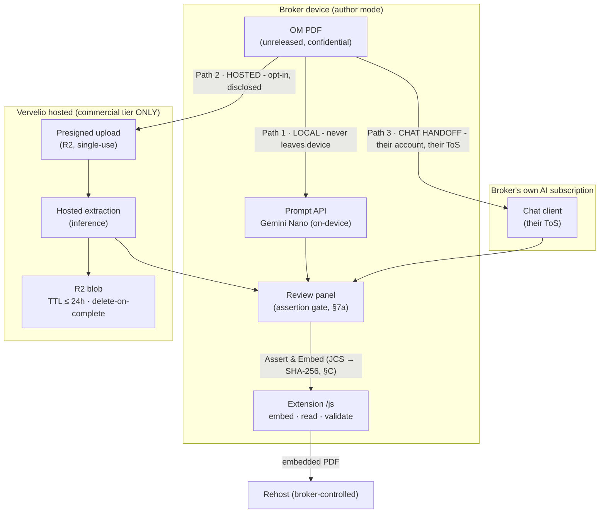
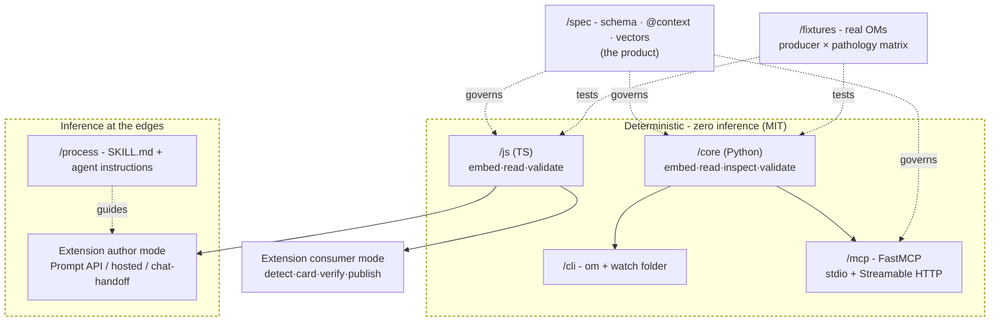
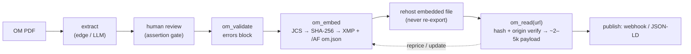
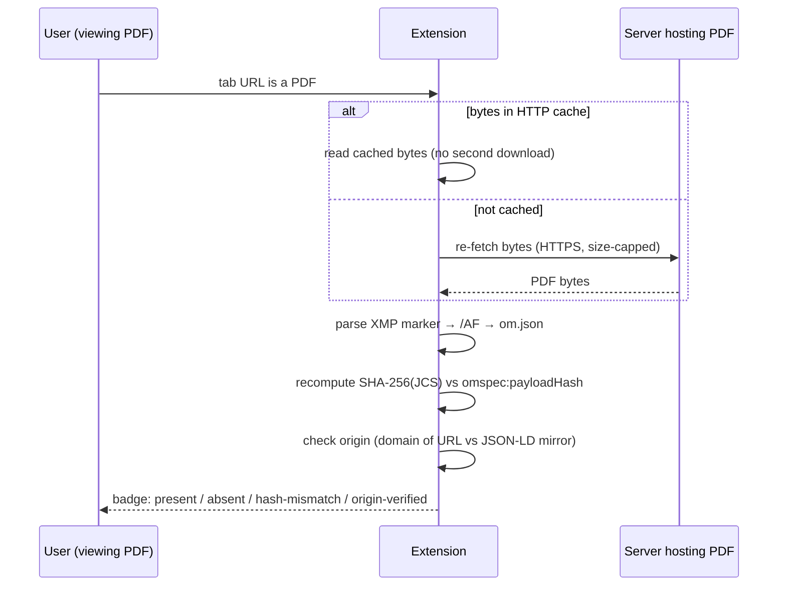
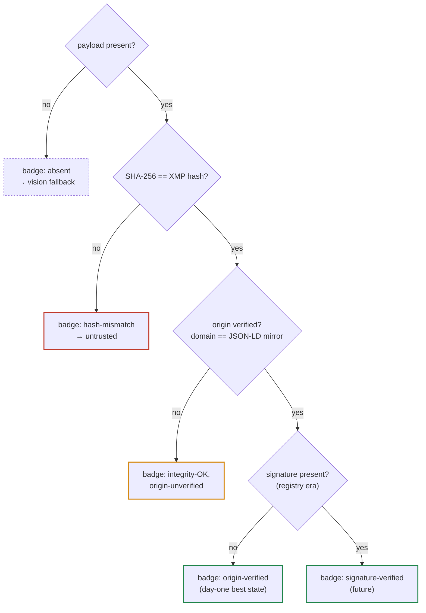
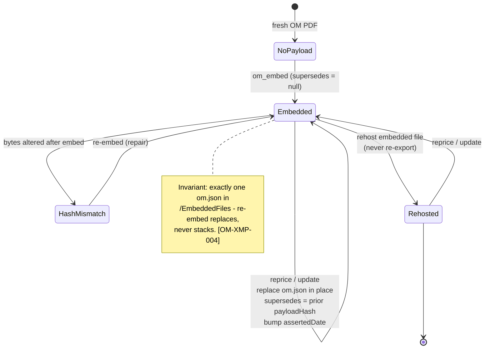
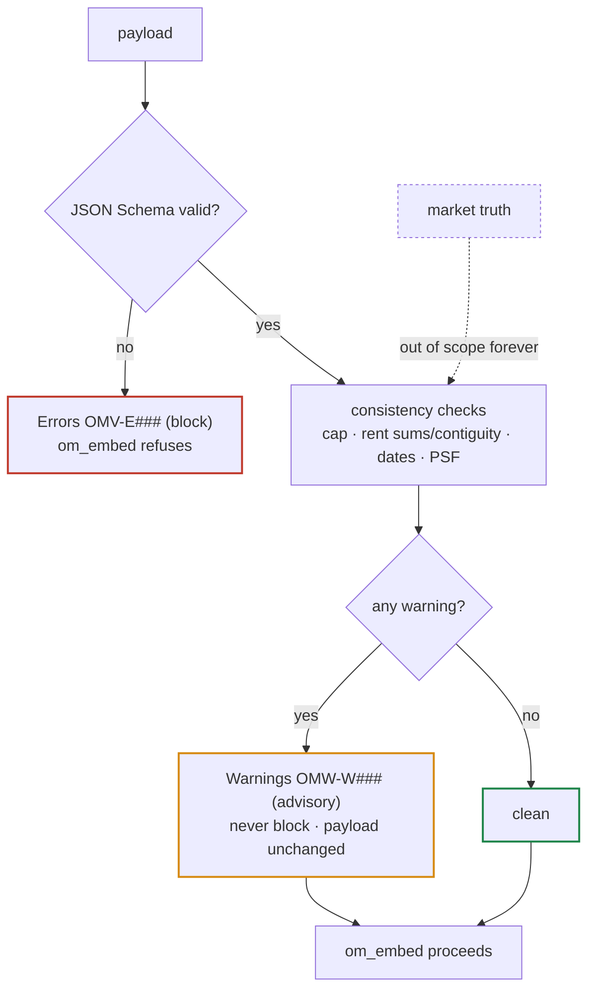
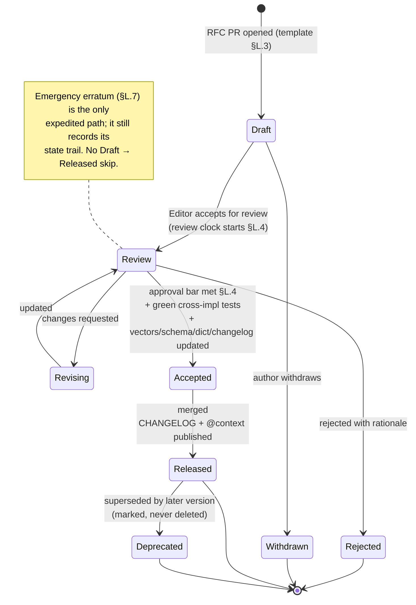

# OpenOM - Normative Specification Draft v0.1 (DEFERRED)

**Status:** deferred until adoption - **NOT required for Milestone 1.** Split out of the handoff at v6.1 so the handoff reads as a handoff. This file holds the normative appendices a mature standards body needs but an org of one does not yet: versioning & compatibility (§F), licensing/patent/trademark (§G), privacy & data governance (§K), governance mechanics (§L), telemetry (§M), diagrams (§N), the worked end-to-end example (§O), the `@context` document & JSON-LD processing model (§P), the identifier & value ABNF grammar (§Q), interoperability capability map (§R), i18n & accessibility (§S), reference implementation & conformance harness (§T), vulnerability disclosure & IP pointers (§U), and the architecture/PDF/validation/webhook/extraction/provenance conformance appendices (§V–§AA).

> The **M1-essential normative core** - §A conformance conventions, §B conformance suite & vectors, §C canonicalization & hashing, §D embedded-file & XMP wire format, §E data dictionary, §H error & warning taxonomy, §I MCP tool contracts, §J security - is authoritative in the handoff ([`om-standard-handoff-v4-updated.md`](om-standard-handoff-v4-updated.md) Part II). Cross-references here to §A–§E and §H–§J resolve there.

> RFC 2119 / RFC 8174 keywords apply exactly as in the handoff Part II. Requirement IDs (`[OM-*]`) are append-only and shared across both files - a master index is a `/spec` build artifact, not maintained by hand here.

---

## §F. Versioning & compatibility policy

- **[OM-VER-001]** The spec version (`specVersion`) follows **SemVer**. Within a major version: additive fields and new OPTIONAL enum members are **minor**; a new REQUIRED field, removed field, narrowed type, or changed field meaning is **major**.
- **[OM-VER-002]** Published `@context` URLs (e.g. `.../ns/0.1`) are **immutable**: once released, the terms a version's context defines MUST NOT change meaning. A breaking change ships under a new context URL (`.../ns/0.2`).
- **[OM-VER-003]** Consumers MUST accept unknown OPTIONAL fields (forward compatibility) and MUST NOT reject a payload solely for containing them.
- **[OM-VER-004]** A Consumer encountering a `specVersion` whose **major** it does not implement MUST degrade gracefully: surface the raw payload + a `OMW-W001 unknown-major-version` warning, and MUST NOT silently misinterpret fields.
- **[OM-VER-005]** The envelope (§5b) versions independently via `envelopeVersion`; the same additive/breaking rules apply.

### §F.1 Change classification (major / minor / patch)

- **[OM-VER-006]** SemVer has three components - `MAJOR.MINOR.PATCH` - and they apply to **the specification document and the toolchain**. The payload's `specVersion` encodes **`MAJOR.MINOR` only** (e.g. `"0.1"`), because a PATCH release MUST NOT change the wire format and therefore leaves every payload byte-identical. `"0.1"` in a payload denotes the `0.1.x` line; a Consumer MUST NOT branch behaviour on a PATCH it cannot observe. (This keeps the §E `specVersion` enum of `"0.1"` correct as written.)

- **[OM-VER-007]** A change MUST be classified by the table below. When a single release mixes classes, the **highest** class wins. The classification is a normative property of the change, recorded in `/spec/CHANGELOG.md` (§L).

| Change | Class | Notes |
|---|---|---|
| New REQUIRED field; remove/rename a field; narrow a type; change a field's meaning, unit, or cardinality | **MAJOR** | Old payloads may become invalid or misread. |
| Remove an enum member; change canonicalization or the hash algorithm (§C); change the block / never-block boundary (§H) | **MAJOR** | Alters the interop contract. |
| Change the meaning of any published `@context` term | **MAJOR** | Forbidden in place - ships under a new context URL (OM-VER-002, OM-VER-020). |
| Add a **blocking** error code (`OMV-E###`) that can reject a payload previously conformant to this MAJOR | **MAJOR** | Producers that emitted valid payloads would newly fail; see OM-VER-008. |
| Add an OPTIONAL field; widen a type; add a member to an **extensible** enum (OM-VER-009) | **MINOR** | Backward compatible; older Consumers ignore it (OM-VER-003, OM-VER-015). |
| Add a warning (`OMW-W###`) or info (`OMI-I###`) code; deprecate (mark, not remove) a field or enum member (OM-VER-010) | **MINOR** | Advisory only; never blocks (OM-ERR-004). |
| Change a documented default tolerance (§H) or add an OPTIONAL tool parameter | **MINOR** | Observable in Validator output / conformance vectors, but never changes payload meaning. |
| Editorial prose clarification with no normative behaviour change; new or expanded **non-normative** examples; new conformance vectors that do not change the expected result of any existing vector; typo, formatting, or diagram fixes | **PATCH** | No wire or behavioural change; payloads and existing vectors are unaffected. |

- **[OM-VER-008]** Adding a new **blocking** error code is MAJOR **if and only if** it can reject a payload that was conformant to the current MAJOR. A blocking code that only formalizes an already-invalid case (e.g. it fires only where the JSON Schema already failed) is a clarification and MAY ship as MINOR or PATCH; the CHANGELOG entry MUST state which, with the reasoning. New warning/info codes are always MINOR (they never block - OM-ERR-004).

- **[OM-VER-009]** **Enum extensibility.** Every enumeration in the schema is either **closed** or **extensible**, and its class MUST be documented in the data dictionary (§E). Extensible enums MAY gain members in a MINOR release; closed enums MAY NOT (a new member is MAJOR). In v0.1: `specVersion` and `noiType` are **closed**; `deal.status`, `lease.leaseTypeAsserted`, `guarantor.type`, and every `source` tag are **extensible**. A Consumer MUST accept an unknown member of an extensible enum, MUST NOT reject the payload for it, and SHOULD emit `OMW-W003 unknown-enum-member` (§H).

### §F.2 Deprecation lifecycle

Every field, enum member, and code moves through exactly three states: **Active → Deprecated → Withdrawn**. State transitions are recorded in `/spec/CHANGELOG.md` (§L) and mirrored in the schema and data dictionary (§E).

- **[OM-VER-010]** **Deprecation is MINOR.** An element is deprecated by (a) setting JSON Schema `"deprecated": true` on it, (b) adding a data-dictionary note naming the version that deprecated it and its replacement (or "no replacement"), and (c) a CHANGELOG entry. A deprecated element remains fully valid.

- **[OM-VER-011]** **Read-vs-write asymmetry.** Once an element is Deprecated, Producers SHOULD stop writing it and SHOULD write its replacement; Consumers MUST continue to read and honour it for the remainder of the current MAJOR. A deprecated element MUST NOT be removed within its MAJOR.

- **[OM-VER-012]** **Withdrawal is MAJOR and requires overlap.** An element MAY be Withdrawn (removed from the schema / made invalid) only at a MAJOR bump, and only if it was Deprecated in **at least one prior MINOR release of the current MAJOR** (a minimum one-release overlap window). Every withdrawal MUST appear in the migration note required by OM-GOV-004.

- **[OM-VER-013]** **Requirement IDs never withdraw by deletion.** A withdrawn *requirement* (as opposed to a schema element) follows OM-CONF-002: it is marked `Deprecated (withdrawn in vX.Y)` in place, never deleted and never renumbered. A withdrawn *code* (§H) follows the same rule - its row is retained and marked, and the code MUST NOT be reused for a different meaning.

- **[OM-VER-014]** **Deprecation is observable, not enforced.** A Validator SHOULD emit `OMI-I010 deprecated-field-present` (info, non-blocking - §H) when a payload uses an element deprecated as of the Validator's spec version. It MUST NOT block on deprecation.

### §F.3 Consumer & Producer forward-compatibility obligations

These obligations make a payload authored under a newer version survive contact with an older tool. They complement OM-VER-003 (accept unknown OPTIONAL fields) and OM-VER-004 (degrade on unknown MAJOR).

- **[OM-VER-015]** **Preserve-verbatim on passthrough (round-trip safety).** A tool that reads a payload and then re-emits, re-publishes, or **re-embeds** it - including the common repricing re-embed (§4) - MUST preserve every field, array element, and object key it does not itself understand, byte-for-byte in meaning, and MUST re-canonicalize the *whole* preserved object (§C) so the recomputed hash covers the preserved fields. A tool MUST NOT drop, reorder-out-of-JCS, or lossily rewrite unknown content. Rationale: a 0.1 tool re-hosting a 0.2 payload MUST NOT silently strip 0.2 fields.

- **[OM-VER-016]** **Minor skew (same MAJOR, newer MINOR).** A Consumer implementing `0.x` that reads `0.y` with `y > x` MUST process all fields it knows, MUST NOT error solely for the version difference, and SHOULD surface `OMW-W002 newer-minor-version` (§H). It MUST apply OM-VER-015 to anything it does not know.

- **[OM-VER-017]** **Patch interchange.** Payloads are identical across PATCH releases (OM-VER-006). A Consumer MUST treat any two `MAJOR.MINOR` payloads as fully interchangeable regardless of the toolchain PATCH that produced them, and MUST NOT condition parsing or validation on PATCH.

- **[OM-VER-018]** **Meaning comes only from the declared version.** A Consumer MUST derive a field's meaning solely from the schema and `@context` of the `specVersion` the payload declares; it MUST NOT infer meaning from field-name resemblance to a different version, nor promote an unknown field to a known one by name.

### §F.4 `@context` immutability & resolution guarantees

Extends OM-VER-002 (published `@context` URLs are immutable; breaking changes ship under a new URL).

- **[OM-VER-019]** **Byte-stable, cacheable, pinnable.** The context document served at a published version URL MUST be byte-stable for the life of that version, MUST be served over HTTPS with long-lived cache headers, and MAY be pinned and cached indefinitely by any implementation. Changing its bytes in place is prohibited (it would silently alter meaning).

- **[OM-VER-020]** **Version agreement.** The `specVersion` in a payload and the version segment of every OpenOM `@context` URL it lists MUST agree (e.g. `"0.1"` ↔ `.../ns/0.1`). A disagreement is a blocking structural error `OMV-E009 version-context-mismatch` (§H).

- **[OM-VER-021]** **No mutable alias in payloads.** A payload's `@context` MUST reference version-pinned URLs only. A mutable or "latest" context alias (e.g. `.../ns/latest` or a bare major alias that tracks the newest minor) MUST NOT appear in a payload. Such aliases MAY exist for documentation, but using one in a payload defeats immutability and is a blocking error under OMV-E009.

- **[OM-VER-022]** **Read-time network independence.** A conformant Consumer MUST be able to read, hash-verify (§C), and schema-validate (§E) a payload for a `specVersion` it implements **without fetching the `@context` over the network** - consistent with the deterministic, no-unsolicited-network stance (§M). Fetching a context, when done at all, MUST treat it as inert JSON under the SSRF/parse rules of OM-SEC-001 and OM-SEC-004, and SHOULD prefer a pinned local copy.

- **[OM-VER-023]** **Minor contexts are strict supersets.** Within a MAJOR, each MINOR publishes its own immutable context URL whose term set is a strict, additive superset of the prior MINOR's (no term removed, no meaning changed). A MAJOR bump is the only path that may drop or redefine a term, under a new context URL (OM-VER-002, OM-GOV-004).

---

## §G. Licensing

- **[OM-LIC-001]** All code (`/core`, `/cli`, `/mcp`, `/js`, `/extension`) is **MIT**.
- **[OM-LIC-002]** The specification text, `/spec/*.schema.json`, the `@context`/vocabulary, and the conformance vectors are licensed **CC-BY-4.0** (attribution to Vervelio). This separation is deliberate: implementers must be free to embed the schema and context without MIT's code-notice obligations, while attribution keeps provenance of the standard clear.
- **[OM-LIC-003]** The vocabulary namespace URI, once published, is a stable identifier under Vervelio stewardship and MUST resolve to the versioned context document.

### §G.1 Patent policy

- **[OM-LIC-004]** **Non-assertion covenant.** Vervelio irrevocably covenants not to assert any patent claim it owns or controls that is necessarily infringed by implementing the normative parts of this specification (the wire format, canonicalization, embedding mechanism, and validation behaviour of §C, §D, §E, §F, §H), against any party for making, using, selling, or distributing a conformant implementation. This covenant runs with each published `specVersion` and cannot be revoked for that version.

- **[OM-LIC-005]** **Contributor grant & defensive termination.** Any party contributing normative material to the specification thereby grants the same non-assertion covenant for patent claims necessarily infringed by their contribution. The covenant to a given party terminates automatically if that party initiates patent litigation alleging that a conformant OpenOM implementation infringes a patent (a standard defensive-termination clause); it is otherwise perpetual.

- **[OM-LIC-006]** **No third-party warranty.** Nothing here is a warranty that implementing OpenOM does not infringe a **third party's** patent, and no such warranty is given. Vervelio's covenant extends only to claims Vervelio or a contributor owns or controls.

### §G.2 Trademark policy

The name "openOM" and the "Vervelio" name and logo are trademarks of Vervelio, distinct from the copyright licenses of §G. Trademark rights are **not** granted by MIT or CC-BY-4.0.

- **[OM-LIC-007]** **Conformance claim.** A party MAY state that an implementation is "OpenOM 0.1 conformant" only if it satisfies every applicable `MUST`/`MUST NOT` for the role(s) it claims (OM-CONF-001) and reproduces the conformance vectors for those roles (§B). The claim MUST name the `specVersion` and the role(s) (Producer/Consumer/Validator). A false or unqualified conformance claim is prohibited use of the mark.

- **[OM-LIC-008]** **Nominative use.** Anyone MAY use the name truthfully to refer to the standard - "reads OpenOM payloads", "compatible with OpenOM 0.1", "supports the OpenOM format" - without permission, provided the use does not imply that Vervelio produces, sponsors, or endorses the referring product.

- **[OM-LIC-009]** **Prohibited uses.** The marks MUST NOT be used: as, or as part of, a product, company, package, or domain name (e.g. an npm/PyPI package or GitHub org named to appear official) without written permission from Vervelio; in a manner suggesting endorsement or official status; or in a modified or confusingly similar form. Publishing a fork or derivative under a name that suggests it is the canonical standard is prohibited.

- **[OM-LIC-010]** **Marks vs. the open license.** Removing or altering the marks does not remove the CC-BY-4.0 attribution obligation on the specification text and vocabulary (OM-LIC-002); the two obligations are independent.

### §G.3 Namespace stewardship & continuity

Extends OM-LIC-003 (the namespace URI is a stable identifier under Vervelio stewardship resolving to the versioned context).

- **[OM-LIC-011]** **Resolution guarantee.** For every released `specVersion`, Vervelio MUST keep the version-pinned `@context` URL resolving to that version's immutable context document (OM-VER-019) and MUST NOT repurpose the URL. A resolution outage is a defect to be repaired, never a licence to change the content.

- **[OM-LIC-012]** **The repository is the survival copy.** The canonical context, schema, and conformance vectors MUST be maintained in the repository under CC-BY-4.0 (OM-LIC-002) so the standard remains fully implementable **even if the namespace domain lapses**. Implementations SHOULD pin the in-repo copy; the hosted URL is a convenience mirror of the committed source of truth, not the only source.

- **[OM-LIC-013]** **Succession.** If stewardship transfers from Vervelio, the successor MUST honour the immutability of all previously published context URLs (OM-VER-002, OM-VER-019) and the non-assertion covenant (OM-LIC-004). Stewardship MUST NOT be transferred to a party that will not commit to these obligations. A transfer MUST be recorded in `/spec/CHANGELOG.md`.

- **[OM-LIC-014]** **No enclosure.** No steward may relicense past published versions of the specification, schema, `@context`, or vocabulary out of CC-BY-4.0, nor place the code out of MIT; the grants for a released version are irrevocable for that version.

### §G.4 License application, SPDX & attribution

- **[OM-LIC-015]** **File layout of the split license.** The repository MUST contain `LICENSE` (MIT, for code) and `LICENSE-SPEC` (CC-BY-4.0, for the specification, schema, `@context`, vocabulary, and conformance vectors), and a top-level `LICENSING.md` naming exactly which paths fall under which license. The `/spec/` tree is CC-BY-4.0; `/core`, `/cli`, `/mcp`, `/js`, and `/extension` are MIT (OM-LIC-001, OM-LIC-002).

- **[OM-LIC-016]** **SPDX identifiers.** Code files SHOULD carry `SPDX-License-Identifier: MIT`; specification and schema/context/vector files SHOULD carry `SPDX-License-Identifier: CC-BY-4.0`. Machine-readable identifiers let downstream tooling detect the boundary automatically.

- **[OM-LIC-017]** **Attribution text.** A compliant CC-BY-4.0 attribution for reused specification material is: “Based on the OpenOM specification, © Vervelio, licensed under CC-BY-4.0,” with a link to the version's `@context` or CHANGELOG entry. Embedding the schema or `@context` verbatim in an implementation satisfies attribution when this notice accompanies it; it does **not** trigger MIT's code-notice obligation (that is the point of the split, OM-LIC-002).

- **[OM-LIC-018]** **Payloads are the author's.** Nothing in §G claims any license over the *data payloads* authors produce with the tool; a broker's `om.json` is the broker's content and is out of scope of the standard's licensing entirely.

---

## §K. Privacy & data governance

- **[OM-PRIV-001] Data-flow per extraction path** (author mode): **local (Prompt API)** - document bytes never leave the device; **hosted** - presigned upload to Vervelio, processed, then deleted per retention; **chat handoff** - bytes go to the broker's own AI subscription under their ToS, never through Vervelio. The extension MUST show which path a given action uses before the document leaves the device.
- **[OM-PRIV-002] Retention (R2).** Uploaded OMs and derived blobs MUST have a documented default TTL (RECOMMENDED ≤ 24 h for extraction inputs) and a delete-on-completion path; unreleased OMs are the sensitive case (§15 Q4).
- **[OM-PRIV-003] Index submission (registry era).** "Submit to index" MUST be opt-in per submission, MUST show exactly what is shared (payload + source URL, not the PDF), and MUST require hash + origin verification before accepting (§11).
- **[OM-PRIV-004] PII.** Payloads carry business-contact data (broker name, license, phone). Producers SHOULD NOT include personal data beyond the professional contact necessary to the assertion.

### §K.1 Data-flow by extraction path

The sensitive asset is the **unreleased OM document**; the payload field values are business data the broker intends to publish once embedded. The three author-mode extraction paths (§5b) differ entirely in where the document travels - the diagram is normative for OM-PRIV-001's disclosure requirement.



Consumer mode (§5b) is separate and carries **no document upload**: it re-fetches already-published PDF bytes and processes them locally (§6a; §M OM-TEL-001); no document or payload data reaches Vervelio unless the user opts into "submit to index" (OM-PRIV-003, OM-PRIV-011).

### §K.2 Classification, consent, retention, deletion, PII

- **[OM-PRIV-005] Data classification.** Three tiers govern handling: **(C1) Document bytes** - the OM PDF, potentially an unreleased/confidential deal; highest sensitivity; leaves the device only on Path 2 (hosted, opt-in) or Path 3 (broker's own account). **(C2) Payload field values** - broker-asserted business data intended for publication once embedded; treated as confidential until the broker asserts+publishes. **(C3) Operational metadata** - URLs, hashes, timestamps, error codes; low sensitivity but MUST be treated per OM-PRIV-009. Each tier's permitted destinations MUST match §K.1; a tool MUST NOT send a higher-tier item to a destination the diagram does not authorize.
- **[OM-PRIV-006] Consent & lawful basis.** Every action that transmits C1 or C2 off-device MUST be an explicit, per-action user choice, and the extension MUST display which path (§K.1) it uses **before** the document leaves the device (restating and strengthening OM-PRIV-001). The hosted path (Path 2) MUST require affirmative opt-in and MUST NOT be a silent or default-on behavior; local (Path 1) is the default. There is no bundled consent - consenting to embedding does not consent to upload.
- **[OM-PRIV-007] Sub-processors, residency & no-training.** The hosted commercial tier MUST publish its sub-processor list (blob storage, any inference provider) and processing region, and MUST offer a DPA on request. Uploaded documents and payloads MUST NOT be used to train or fine-tune any model, MUST NOT be retained beyond the OM-PRIV-002 TTL, and MUST NOT be shared with any party outside the disclosed sub-processors. The open server, `/core`, `/cli`, and consumer mode have **no** sub-processors - they transmit nothing beyond the explicit fetch a user invoked (§M OM-TEL-001).
- **[OM-PRIV-008] Deletion & erasure.** Hosted uploads MUST be deleted on extraction completion and, failing that, on TTL expiry (OM-PRIV-002); deletion MUST cover derived blobs and caches, not only the original. The hosted service MUST provide a documented deletion-request path for a data subject or the uploading principal. Registry submissions (OM-PRIV-003) MUST be withdrawable by the verified origin (OM-PRIV-011). Deletion requests MUST be honored within a documented window.
- **[OM-PRIV-009] PII-safe logging.** Logs (local or hosted) MUST NOT contain C1 document bytes or C2 payload field values; they MAY contain C3 operational metadata (hashes, URLs, error codes, timings). Hosted logs containing any URL or identifier MUST be access-controlled and retention-bounded. This aligns with §M OM-TEL-003 (local logs permitted; never transmitted by default).
- **[OM-PRIV-010] Payload data minimization.** A payload SHOULD carry only the professional contact necessary to the assertion (broker name, brokerage, license #, business phone/email) - strengthening OM-PRIV-004. Producers MUST NOT embed personal/consumer PII: no SSNs or tax IDs, no personal home addresses, no tenant employees' or occupants' personal data, no third-party contact data captured without basis. Property occupant PII is out of scope for v0.1. The review panel (assertion gate) SHOULD surface fields flagged as potential personal data before Assert & Embed.
- **[OM-PRIV-011] Registry erasure (right to withdraw).** In the registry era (§11), an index entry MUST be removable on request by the verified origin (hash + origin verified, §10), and a superseding/withdrawn payload MUST be reflected (the index MUST NOT continue to serve a withdrawn or superseded assertion as current). What a submission shares is fixed by OM-PRIV-003 (payload + source URL, never the PDF); withdrawal removes both from the reference index.

---

## §L. Governance mechanics

Governance exists to make change to a *published* contract safe, attributable, and reversible in meaning-preserving ways. The process is deliberately lightweight for 0.1 but fully specified: every change has a defined path, an owner, an approval bar, and a record. This section is the change-control process; the RFC lifecycle is visualized in **§N.7**.

### §L.1 Stewardship & roles

- **[OM-GOV-001]** The standard is stewarded by **Vervelio**. Changes proceed by a lightweight RFC: a proposal PR against `/spec` describing motivation, wire impact, and compatibility class (§F).
- **[OM-GOV-005]** The following roles are defined; one person MAY hold several, but the **Steward** and an approving **Spec Editor** on the same change MUST NOT be the same individual for a `major` change:
  - **Steward (Vervelio).** Owns the namespace, `@context` URLs, trademarks, and the security-disclosure inbox; is the final tie-breaker; appoints and removes Spec Editors. Accountable for neutrality (§2 - published under Vervelio, not Fortis).
  - **Spec Editors.** A small group (RECOMMENDED ≥ 2) with merge rights on `/spec`. They accept RFCs for review, request changes, and record decisions. Editors SHOULD include at least one implementer of `/core` and one of `/js` so cross-implementation impact (§B) is represented.
  - **Contributors.** Anyone opening an RFC/PR. Bound by the IP policy (§L.6).
  - **Security contact.** The role that receives and coordinates vulnerability reports (§L.5); defaults to the Steward.
- **[OM-GOV-006]** Role changes (adding/removing an Editor, transferring stewardship) MUST be recorded in `/spec/GOVERNANCE.md` with an effective date. Stewardship transfer (e.g. to a neutral foundation) MUST preserve every published `@context` URL as an immutable, resolvable identifier (§F [OM-VER-002], [OM-LIC-003]).

### §L.2 The RFC lifecycle

- **[OM-GOV-007]** Every normative change MUST move through the state machine of **§N.7**. The states are exhaustive and their transitions are the only permitted ones:
  1. **Draft** - RFC PR opened using the template (§L.3). No review commitment yet.
  2. **Review** - an Editor has accepted the RFC for review; the review clock (§L.4) starts.
  3. **Revising** - changes requested; returns to **Review** when updated.
  4. **Accepted** - approval bar met (§L.4) *and* all merge preconditions green (§L.5-of-versioning / [OM-GOV-002]).
  5. **Released** - merged; changelog and (for a new version) the `@context` document published.
  6. **Rejected** / **Withdrawn** - terminal; the PR and rationale are retained for the record, never force-deleted.
  7. **Deprecated** - a previously Released item marked superseded; retained per [OM-CONF-002] (marked, never deleted).
- **[OM-GOV-008]** An RFC MUST NOT skip **Review** (no direct Draft→Released). An **emergency erratum** (§L.7) is the only expedited path and still records its state trail.

### §L.3 RFC content & approval

- **[OM-GOV-009]** An RFC PR MUST contain, in `/spec/rfcs/NNNN-slug.md`: (a) **motivation**; (b) **exact wire impact** (fields/enums/XMP/embedded-file changes); (c) **compatibility class** per §F (`minor` = additive/new OPTIONAL enum member; `major` = new REQUIRED field, removal, narrowed type, or changed meaning); (d) **migration note** if `major`; (e) **conformance-vector deltas** (§B) for any wire change; (f) **security & privacy impact** (§J/§K), even if "none."
- **[OM-GOV-002]** A change MUST update: the JSON Schema, the data dictionary (§E), the changelog, and (for wire changes) the conformance vectors (§B). A change MUST NOT merge without green cross-impl tests.
- **[OM-GOV-010]** **Approval bar by class.** A `minor`/editorial change MUST have ≥ 1 Spec Editor approval. A `major` change MUST have ≥ 2 Spec Editor approvals **and** explicit Steward sign-off. Any unresolved **formal objection** by an Editor blocks **Accepted**; the Steward MAY override a single blocking objection on a non-`major` change, recording the rationale in the RFC.
- **[OM-GOV-011]** **Minimum review windows** (calendar days from entering **Review** to eligible for **Accepted**), to give implementers time to weigh in: editorial - 0; `minor` - ≥ 7; `major` - ≥ 21. Windows MAY be shortened only for an erratum (§L.7).

### §L.4 Changelog & version registry discipline

- **[OM-GOV-003]** Each released `specVersion` is recorded in `/spec/CHANGELOG.md` with its `@context` URL; the set of live versions is the version registry. Deprecations follow OM-CONF-002 (marked, never deleted).
- **[OM-GOV-004]** Breaking changes require a new major, a new immutable `@context` URL, and a migration note.
- **[OM-GOV-012]** Each `/spec/CHANGELOG.md` entry MUST record, per released version: version string, release date, compatibility class, `@context` URL, the RFC number(s) merged, the requirement IDs added/deprecated, and a one-line migration pointer for `major`. The changelog is **append-only**; a released entry MUST NOT be edited except to append a *Deprecated in vX.Y* marker.
- **[OM-GOV-013]** A release MUST NOT be tagged unless the matching conformance vectors (§B [OM-VEC-001]) and cross-implementation round-trip test ([OM-VEC-002]) are green on the release commit. The reference implementations (`/core`, `/js`) MUST implement a `major` change in the **same release** it is published - the spec MUST NOT ship ahead of a working reference reader/writer.

### §L.5 Erratum (spec-defect) process

- **[OM-GOV-014]** A **spec defect** (a normative statement that is internally contradictory, ambiguous to the point of non-interoperability, or contradicts a green test) is fixed by an **erratum**: a clarifying change that MUST NOT alter the meaning any conformant implementation could have relied on. An erratum MAY use shortened review windows ([OM-GOV-011]) but MUST still pass [OM-GOV-002]/[OM-GOV-013]. If a "fix" would change meaning, it is not an erratum - it is a `major` change and follows §L.3.

### §L.6 Security disclosure & advisories (CVE)

- **[OM-GOV-015]** **Reporting channel.** The repositories MUST publish a `SECURITY.md` and a `/.well-known/security.txt` on the project domain naming a private contact (security mailbox) and the coordinated-disclosure policy. Reporters MUST have a private path (GitHub Security Advisories draft and/or the security mailbox); vulnerabilities MUST NOT be required to be filed as public issues.
- **[OM-GOV-016]** **Triage SLA & severity.** The Security contact MUST acknowledge a report within **3 business days** and give an initial assessment within **10 business days**. Severity MUST be scored with **CVSS v3.1/v4.0**. Target remediation windows by severity: Critical/High - fix or documented mitigation within **30 days**; Medium - **90 days**; Low - next scheduled release.
- **[OM-GOV-017]** **Coordinated disclosure & identifiers.** Default embargo is **90 days** or until a fix ships, whichever is sooner; the Steward MAY extend for downstream coordination. On disclosure the project MUST publish a **GitHub Security Advisory** and MUST request a **CVE** for any vulnerability affecting a published artifact (PyPI/npm/Web Store). Fixed versions, affected ranges, and workarounds MUST be listed; the advisory is linked from `/spec/CHANGELOG.md`.
- **[OM-GOV-018]** **Vulnerability scope boundary.** A security vulnerability is a defect enabling unintended access, code execution, resource exhaustion, or trust misrepresentation in an implementation (e.g. SSRF §J [OM-SEC-001], decompression bombs [OM-SEC-002], HMAC-secret leakage [OM-SEC-003], presenting `hashValid` as authorship [OM-SEC-005]). A broker asserting false market facts is **NOT** a vulnerability - market truth is out of scope forever (§10 Non-goals) and MUST NOT be triaged as one. Reports of content falsehood are closed with a pointer to the four-layer trust model (§10).

### §L.7 Intellectual-property policy

- **[OM-GOV-019]** **Contribution terms.** Every contribution MUST carry a **Developer Certificate of Origin (DCO)** `Signed-off-by` line. By contributing, the contributor licenses code contributions under **MIT** and specification/vocabulary/vector contributions under **CC-BY-4.0** (§G), and grants a non-exclusive, royalty-free **patent license** to any of their patent claims necessarily infringed by their contribution as merged. No contributor may later assert such patents against conformant implementations of the version their contribution shipped in.
- **[OM-GOV-020]** **Trademark & conformance mark.** "openOM" and the Vervelio marks are Vervelio's. The **specification and code are freely usable** under §G, but the *names/marks* MAY be used to describe conformance ("OpenOM 0.1 conformant") only by implementations that pass the conformance suite (§B) for the role(s) they claim (§A [OM-CONF-004]); they MUST NOT be used to imply endorsement of a non-conformant product or to name a fork. Forking the open spec is permitted under §G; using the marks for the fork is not. This anti-capture rule is the counterpart to the MIT/CC-BY openness: the standard is free to implement, the *name* certifies conformance.

---

## §M. Telemetry & observability stance

The zero-telemetry stance is a *verifiable* property, not a promise: the deterministic layers make no network request the user did not ask for, and that fact is enforced in CI and checkable by any third party from the SBOM and a reproducible build.

### §M.1 The stance

- **[OM-TEL-001]** `/core`, `/cli`, the open MCP server, and extension **consumer mode** MUST NOT phone home, collect analytics, or emit network requests beyond the explicit operation the user invoked (e.g. an `om_read(url)` fetch).
- **[OM-TEL-002]** Any analytics in author mode or the hosted commercial service MUST be **opt-in**, disclosed, and MUST NOT transmit document contents or payload field values.
- **[OM-TEL-003]** Local structured logs are permitted; they MUST NOT be transmitted by default.

### §M.2 The egress allowlist (precise boundary)

- **[OM-TEL-004]** The **only** network destinations the deterministic layers MAY contact, and only as the direct result of a user-invoked operation, are:
  - **`/core`, `/cli`:** the exact HTTPS URL(s) passed as tool arguments (a PDF URL, a `@context` URL fetched inertly per §J [OM-SEC-004]). Nothing else. Offline invocation on local paths MUST make zero network calls.
  - **Open MCP server:** the client transport connection and the user-supplied fetch/blob targets, subject to the SSRF rules (§J [OM-SEC-001]). No analytics, no license/update check, no error beacon.
  - **Extension consumer mode:** the re-fetch of the viewed PDF's own URL, the optional `@context`/JSON-LD-mirror fetch for origin verification (§10), and the user-configured **webhook** target on explicit Publish. No third-party endpoint is contacted implicitly.
  Any destination not in this list is a conformance defect and (if it exfiltrates data) a vulnerability (§L.6 [OM-GOV-018]).

### §M.3 Auditability (the promise is testable)

- **[OM-TEL-005]** A CI test MUST run `/core`, the standalone validator, and the consumer-mode `/js` read/validate paths **with all network egress denied** (sandbox/firewall) against the fixtures (§14) and MUST assert every operation completes without attempting a socket the user did not initiate. This **offline test is a required gate** on every commit, alongside the cross-impl round-trip ([OM-VEC-002]). It is what makes [OM-TEL-001]/[OM-TEL-004] auditable rather than aspirational.
- **[OM-TEL-006]** The deterministic layers MUST NOT bundle any third-party analytics, telemetry, crash-reporting, A/B, or attribution SDK. A dependency-audit step in CI MUST fail the build if such a dependency (or a transitive one that opens network egress at import time) enters `/core`, `/cli`, `/mcp`, or consumer-mode `/js`.
- **[OM-TEL-011]** Each published artifact (PyPI, npm, Chrome Web Store, hosted server image) MUST ship with a **CycloneDX or SPDX SBOM**, and the builds SHOULD be **reproducible** (documented toolchain + pinned lockfiles) so an independent party can rebuild the artifact bit-for-bit and confirm no undisclosed network code was added. The SBOM is referenced from the release (§L.4 [OM-GOV-012]).

### §M.4 Opt-in analytics & operational data (author mode / hosted service)

- **[OM-TEL-007]** Where analytics are offered (author mode, hosted service only), they MUST be **off by default**, enabled by an explicit affirmative action, revocable at any time, and MUST collect only a bounded, documented event set: coarse action counts and error **codes** (§H), tool/version, and a rotating anonymous install id. They MUST NOT collect document bytes, payload field values, addresses, party names, license numbers, URLs of user documents, or any content derived from an OM. The exact event schema MUST be published.
- **[OM-TEL-008]** **Crash/error reporting**, if offered, follows [OM-TEL-007] (opt-in, disclosed) and MUST scrub payloads, file contents, and user URLs from stack traces and breadcrumbs before transmission; by default a crash writes a **local** report only (§M.1 [OM-TEL-003]).
- **[OM-TEL-009]** The Chrome extension MUST request the **minimum permissions** required per persona and MUST NOT request broad host permissions to enable analytics. The Web Store **data-safety disclosure** MUST exactly match actual behavior: consumer mode discloses "no data collected"; author mode discloses each opt-in category and the per-extraction data flow (§K [OM-PRIV-001]).
- **[OM-TEL-010]** The hosted commercial service MUST honor **Global Privacy Control (GPC)** and **Do Not Track (DNT)** signals as an opt-out of any non-essential analytics, and MUST NOT use dark patterns to obtain the [OM-TEL-007] opt-in.

---

## §N. Diagrams

> **Theme-agnostic rule.** These diagrams MUST render legibly in both light and dark artifact themes. They therefore use **no fill colors** (which fix text/background contrast to one theme) - emphasis is carried by **stroke color and shape only**, so node labels always use the viewer's default (theme-adaptive) text color. Line breaks use `<br/>`. The `classDef` accents below set `stroke` and `stroke-width` only, never `fill` or `color`.

### N.1 Layered architecture

*The cardinal boundary (§6a): everything in the top subgraph - plus consumer mode - contains zero inference. Inference lives only in the Edge subgraph.*

### N.2 Embed → rehost → read round-trip

*The dashed edge is the idempotent re-embed loop (§4, §N.5): repricing replaces the payload in place - no signing step (§10).*

### N.3 Consumer-mode detection (re-fetch, never viewer)

*Detection re-fetches bytes; it never scrapes the viewer's internals (§5b, Non-goals).*

### N.4 Provenance verification decision tree

*Maps 1:1 to the four-layer model (§10): each downward step is one layer. `hashValid=true` never means "authentic" (§J [OM-SEC-005]).*

### N.5 Re-embed / supersedes state machine

*Repricing is a first-class, one-click operation with no signing step (§4, §10). Re-export leaves this diagram entirely - it destroys the attachment (Non-goals).*

### N.6 Two-tier validation flow

*Hard boundary (§9, §H): schema errors block embedding; consistency warnings inform but never block and never mutate the payload; market truth is never evaluated.*

### N.7 Governance RFC lifecycle (see §L.2)

*Terminal states (Rejected/Withdrawn/Released/Deprecated) retain their record per [OM-CONF-002]; a `major` change also demands Steward sign-off and a same-release reference implementation (§L [OM-GOV-010], [OM-GOV-013]).*

---

## §O. Worked end-to-end example (informative)

This appendix is **informative**. It carries one fictional STNL deal from authored payload → canonical bytes → hash → embedded PDF → `om_read` output → reprice, showing the *exact* bytes at each step so an implementer can diff their output. The abstract rules live in §C/§D/§E/§I; this is their ground truth.

- **[OM-EX-001]** This example is non-normative but **reproducible**: a conformant Producer canonicalizing the O.1 payload MUST produce the O.2 byte string and the O.3 hash exactly (§C). Any divergence is a canonicalization defect, not an allowed variation.
- **[OM-EX-002]** This example MUST be committed under `/spec/vectors/` (§B) as `payloads/example-stnl.json`, `expected/example-stnl.json` (JCS + hash + empty `om_validate` report), and `pdfs/example-stnl.pdf` with `example-stnl.expected.json`, and MUST be exercised by the cross-implementation round-trip test [OM-VEC-002].

### O.1 The authored payload
A fictional single-tenant **NNN** retail asset: 9,100 SF, built 2019, in-place NOI \$115,625, asking \$1,850,000 (6.25% cap), one corporate-guaranteed tenant, two remaining rent-schedule periods with a 10% mid-term bump and four 5-year options. The broker authors the compact JSON-LD below. Per [OM-CANON-003] the key `meta.signature` is **absent** (not `null`) in the bytes that get hashed.

```json
{
  "@context": ["https://schema.org", "https://openom.app/ns/0.1"],
  "@type": "RealEstateListing",
  "specVersion": "0.1",
  "currency": "USD",
  "assertedBy": { "broker": "Jane Example", "brokerage": "Example Net Lease Advisors", "license": "MI 6501-000000" },
  "assertedDate": "2026-08-15",
  "property": {
    "address": { "streetAddress": "1000 Example Rd", "addressLocality": "Sampleville", "addressRegion": "MI", "postalCode": "48000", "addressCountry": "US" },
    "geo": { "latitude": 42.0, "longitude": -83.0 },
    "apn": "00-000-000-000", "buildingSF": 9100, "lotAcres": 1.25, "yearBuilt": 2019
  },
  "deal": { "askingPrice": 1850000, "capRate": 0.0625, "noi": 115625, "noiType": "in-place", "noiAsOfDate": "2026-06-30", "status": "active" },
  "lease": {
    "tenantEntity": "Example Retail Stores, LLC",
    "guarantor": { "name": "Example Retail Corp.", "type": "corporate" },
    "landlordResponsibilities": { "roof": false, "structure": false, "parking": false, "hvac": false, "taxes": false, "insurance": false, "cam": false },
    "leaseTypeAsserted": "NNN",
    "commencement": "2019-05-01", "expiration": "2034-04-30",
    "rentSchedule": [
      { "periodStart": "2024-05-01", "periodEnd": "2029-04-30", "annualRent": 115625, "rentPSF": 12.70, "source": "asserted" },
      { "periodStart": "2029-05-01", "periodEnd": "2034-04-30", "annualRent": 127188, "rentPSF": 13.98, "escalationFromPrior": 0.10, "source": "asserted" }
    ],
    "options": [ { "count": 4, "lengthYears": 5, "escalation": "10% per option" } ]
  },
  "meta": { "sourceDocHash": "sha256:9f2c4e1a7b6d3c8e5f0a1b2c3d4e5f60718293a4b5c6d7e8f9012345678abcd0", "supersedes": null }
}
```

### O.2 Canonical form - RFC 8785 JCS (§C)
Keys sorted by UTF-16 code unit at every level; no whitespace; ECMAScript number formatting. **Two subtleties that break naive implementations are visible here:** `geo.latitude` `42.0` canonicalizes to `42` and `longitude` `-83.0` to `-83` (integer-valued numbers lose the fraction), and `rentPSF` `12.70` canonicalizes to `12.7` and `escalationFromPrior` `0.10` to `0.1` (trailing zeros dropped) - per [OM-CANON-006], Producers MUST NOT depend on trailing-zero formatting for equality. The result is **1441 bytes**, one line (wrapped here only for display):

```text
{"@context":["https://schema.org","https://openom.app/ns/0.1"],"@type":"RealEstateListing","assertedBy":{"broker":"Jane Example","brokerage":"Example Net Lease Advisors","license":"MI 6501-000000"},"assertedDate":"2026-08-15","currency":"USD","deal":{"askingPrice":1850000,"capRate":0.0625,"noi":115625,"noiAsOfDate":"2026-06-30","noiType":"in-place","status":"active"},"lease":{"commencement":"2019-05-01","expiration":"2034-04-30","guarantor":{"name":"Example Retail Corp.","type":"corporate"},"landlordResponsibilities":{"cam":false,"hvac":false,"insurance":false,"parking":false,"roof":false,"structure":false,"taxes":false},"leaseTypeAsserted":"NNN","options":[{"count":4,"escalation":"10% per option","lengthYears":5}],"rentSchedule":[{"annualRent":115625,"periodEnd":"2029-04-30","periodStart":"2024-05-01","rentPSF":12.7,"source":"asserted"},{"annualRent":127188,"escalationFromPrior":0.1,"periodEnd":"2034-04-30","periodStart":"2029-05-01","rentPSF":13.98,"source":"asserted"}],"tenantEntity":"Example Retail Stores, LLC"},"meta":{"sourceDocHash":"sha256:9f2c4e1a7b6d3c8e5f0a1b2c3d4e5f60718293a4b5c6d7e8f9012345678abcd0","supersedes":null},"property":{"address":{"addressCountry":"US","addressLocality":"Sampleville","addressRegion":"MI","postalCode":"48000","streetAddress":"1000 Example Rd"},"apn":"00-000-000-000","buildingSF":9100,"geo":{"latitude":42,"longitude":-83},"lotAcres":1.25,"yearBuilt":2019},"specVersion":"0.1"}
```

### O.3 Integrity hash (§C)
`SHA-256` over those 1441 UTF-8 bytes:

```text
sha256:2da65fa4a76c34a65297816ca3edfd8b1caad8cd7cf4bbbb1add3f4a5ef8bcbd
```

This value goes in XMP `omspec:payloadHash` (§D.2) - never inside the payload ([OM-CANON-003]).

### O.4 XMP marker written to the PDF (§D.2)
```xml
<rdf:Description rdf:about="" xmlns:omspec="https://openom.app/ns/0.1#">
  <omspec:specName>OpenOM</omspec:specName>
  <omspec:specVersion>0.1</omspec:specVersion>
  <omspec:payloadFilename>om.json</omspec:payloadFilename>
  <omspec:payloadHash>sha256:2da65fa4a76c34a65297816ca3edfd8b1caad8cd7cf4bbbb1add3f4a5ef8bcbd</omspec:payloadHash>
  <omspec:assertedDate>2026-08-15</omspec:assertedDate>
</rdf:Description>
```

### O.5 Embedded-file object sketch (§D.1)
```text
<< /Type /Filespec /F (om.json) /UF (om.json) /AFRelationship /Data
   /EF << /F 12 0 R /UF 12 0 R >> >>
12 0 obj << /Type /EmbeddedFile /Subtype /application#2Fld+json
   /Params << /Size 1441 /ModDate (D:20260815000000Z) >>
   /Length 1441 >>   % stream = the exact O.2 bytes (Flate optional; hash is over decompressed bytes)
```
The catalog `/Names /EmbeddedFiles` name tree references this `/Filespec`, and the catalog `/AF` array references it too ([OM-EMB-002]).

### O.6 `om_read(url)` output (§I)
```json
{ "payload": { "@context": ["https://schema.org", "https://openom.app/ns/0.1"], "specVersion": "0.1", "deal": { "askingPrice": 1850000, "capRate": 0.0625, "noi": 115625, "noiType": "in-place" } },
  "verification": { "hashValid": true, "originVerified": null, "signatureValid": null } }
```
(`originVerified` is `null` when read from a path or an unmirrored URL; `true`/`false` only when consumer mode has a domain to check against, §10 layer 3. `signatureValid` is `null` forever in 0.1, §10 layer 4.)

### O.7 A reprice (the `supersedes` step, §4 / [OM-XMP-004])
The most common re-embed event. The broker cuts the price to \$1,795,000 (recomputed cap `115625 ÷ 1795000 = 0.06442`, rounded to `0.0644`), bumps `assertedDate` to `2026-09-01`, sets `meta.supersedes` to the O.3 hash, and re-embeds. **No signing step** (§10). The new canonical form is **1510 bytes** and hashes to:

```text
sha256:1b8ccb218a65939ac3cf97c12251e034badc42cb25e1cfe882edd5915590a31f
   meta.supersedes = "sha256:2da65fa4a76c34a65297816ca3edfd8b1caad8cd7cf4bbbb1add3f4a5ef8bcbd"
```
The Producer replaces the single `om.json` in place and updates `omspec:supersedes` - it MUST NOT leave a second `om.json` in `/EmbeddedFiles` ([OM-XMP-004]).

---

## §P. The `@context` document & JSON-LD processing model

The payload is JSON-LD (§7b); this appendix specifies the published `@context` document, the term→IRI mapping, and how Consumers MAY expand/frame it - and, load-bearingly, how JSON-LD processing relates to canonicalization (§C).

- **[OM-LD-001]** The custom namespace `https://openom.app/ns/0.1` MUST resolve to a JSON-LD `@context` document served as `application/ld+json`. Its terms are **immutable** once published ([OM-VER-002]); a breaking change ships under `.../ns/0.2`.
- **[OM-LD-002] Canonicalization operates on the compact authored form, not the expanded graph.** The §C JCS bytes and the integrity hash are computed over the payload document **exactly as authored** (a compact JSON-LD object with an `@context` array). Consumers MUST NOT expand, flatten, or re-frame a payload before hashing or hash comparison, and MUST NOT treat an expanded document as canonical. Expansion and framing (below) are read-side conveniences only.
- **[OM-LD-003]** A Consumer performing JSON-LD expansion MUST fetch remote contexts as inert JSON under the §J range rules ([OM-SEC-001], [OM-SEC-004]) and SHOULD pin/cache the `0.1` context (its terms cannot change, so an offline copy is authoritative). A Consumer that does **not** do graph processing MUST still read the payload as plain JSON keyed by the term names in §E - JSON-LD conformance is not required to consume OpenOM.
- **[OM-LD-004]** Custom terms MUST be defined in the context with explicit datatypes where non-string: numeric ratios (`capRate`, `escalationFromPrior`) as `xsd:decimal`, monetary values as `xsd:decimal`, dates as `xsd:date`, booleans as `xsd:boolean`. `rentSchedule` MUST be defined as an ordered list (`"@container": "@list"`) so array order (chronology, [OM-CANON-002]) is preserved under expansion.
- **[OM-LD-005]** schema.org terms (`RealEstateListing`, `Offer`, `Place`, `PostalAddress`, `Organization`, `geo`, `address`) are used with their schema.org IRIs; OpenOM-specific terms take the custom namespace. Where a concept exists in both, the schema.org term is used and the custom namespace adds only what schema.org lacks (rent schedules, net-lease responsibilities, assertion provenance).

### P.1 `@context` document skeleton (`/spec/context/0.1.jsonld`)
```json
{
  "@context": {
    "@version": 1.1,
    "schema": "https://schema.org/",
    "om": "https://openom.app/ns/0.1#",
    "xsd": "http://www.w3.org/2001/XMLSchema#",

    "RealEstateListing": "schema:RealEstateListing",
    "specVersion": "om:specVersion",
    "currency": { "@id": "om:currency" },

    "assertedBy": { "@id": "om:assertedBy" },
    "broker": "schema:name",
    "brokerage": { "@id": "om:brokerage" },
    "license": { "@id": "om:license" },
    "assertedDate": { "@id": "om:assertedDate", "@type": "xsd:date" },

    "property": { "@id": "om:property" },
    "address": "schema:address",
    "geo": "schema:geo",
    "apn": { "@id": "om:apn" },
    "buildingSF": { "@id": "om:buildingSF", "@type": "xsd:decimal" },
    "lotAcres": { "@id": "om:lotAcres", "@type": "xsd:decimal" },

    "deal": { "@id": "om:deal" },
    "askingPrice": { "@id": "om:askingPrice", "@type": "xsd:decimal" },
    "capRate": { "@id": "om:capRate", "@type": "xsd:decimal" },
    "noi": { "@id": "om:noi", "@type": "xsd:decimal" },
    "noiType": { "@id": "om:noiType" },
    "noiAsOfDate": { "@id": "om:noiAsOfDate", "@type": "xsd:date" },

    "lease": { "@id": "om:lease" },
    "tenantEntity": { "@id": "om:tenantEntity" },
    "guarantor": { "@id": "om:guarantor" },
    "landlordResponsibilities": { "@id": "om:landlordResponsibilities" },
    "leaseTypeAsserted": { "@id": "om:leaseTypeAsserted" },
    "commencement": { "@id": "om:commencement", "@type": "xsd:date" },
    "expiration": { "@id": "om:expiration", "@type": "xsd:date" },
    "rentSchedule": { "@id": "om:rentSchedule", "@container": "@list" },
    "periodStart": { "@id": "om:periodStart", "@type": "xsd:date" },
    "periodEnd": { "@id": "om:periodEnd", "@type": "xsd:date" },
    "annualRent": { "@id": "om:annualRent", "@type": "xsd:decimal" },
    "rentPSF": { "@id": "om:rentPSF", "@type": "xsd:decimal" },
    "escalationFromPrior": { "@id": "om:escalationFromPrior", "@type": "xsd:decimal" },
    "source": { "@id": "om:source" },

    "meta": { "@id": "om:meta" },
    "sourceDocHash": { "@id": "om:sourceDocHash" },
    "supersedes": { "@id": "om:supersedes" },
    "signature": { "@id": "om:signature" }
  }
}
```

### P.2 Expansion (worked, informative)
Expanding the `deal` node of §O.1 replaces terms with IRIs and typed values:
```json
[ { "https://openom.app/ns/0.1#askingPrice": [ { "@value": "1850000", "@type": "http://www.w3.org/2001/XMLSchema#decimal" } ],
    "https://openom.app/ns/0.1#capRate":     [ { "@value": "0.0625", "@type": "http://www.w3.org/2001/XMLSchema#decimal" } ],
    "https://openom.app/ns/0.1#noiType":     [ { "@value": "in-place" } ] } ]
```
The expanded form is a graph for interop tools; it is **not** hashed ([OM-LD-002]).

### P.3 Framing (worked, informative)
A buy-side agent that wants a flat deal-screen frames the payload:
```json
{ "@context": "https://openom.app/ns/0.1",
  "@type": "RealEstateListing",
  "deal": { "askingPrice": {}, "capRate": {}, "noiType": {} },
  "assertedBy": { "broker": {}, "license": {} } }
```
Framing yields the same field values as reading the JSON directly - it is provided so graph-native consumers can join OpenOM data with other schema.org sources, not as a required processing step.

---

## §Q. Identifier & value grammar (ABNF)

The following grammars are **normative** and use ABNF per **RFC 5234** (core rules `DIGIT`, `ALPHA`, `HEXDIG` as defined there; `HEXDIG` is further constrained below). They pin the exact form of every string OpenOM parses for a trust or interop decision. Where this grammar and prose disagree, the grammar wins for lexical form; semantics remain with the cited section.

- **[OM-ABNF-001]** The integrity hash and every field that carries one (`omspec:payloadHash`, `meta.supersedes` when non-null, `meta.sourceDocHash`) MUST match `hash-value`. Hex digits MUST be **lowercase** ([OM-CANON-003]); an uppercase digit is non-conformant.
- **[OM-ABNF-002]** The versioned namespace/`@context` URI MUST match `ns-uri`; the XMP RDF namespace adds a trailing `#` and MUST match `ns-namespace`.
- **[OM-ABNF-003]** The embedded-file `/Subtype` name MUST match `pdf-mime-name` (PDF name-object escaping of the MIME type, [OM-EMB-004]).
- **[OM-ABNF-004]** Dates, timestamps, and codes MUST match `iso-date` / `iso-timestamp` / `currency-code` / `region-code` ([OM-DD-002]).

```abnf
; ---- integrity / content hashes (§C) ----
hash-value    = hash-alg ":" hash-hex
hash-alg      = "sha256"                 ; only sha256 in 0.1; new algs = new tokens, append-only
hash-hex      = 64lc-hexdig              ; 256 bits, lowercase
lc-hexdig     = DIGIT / "a" / "b" / "c" / "d" / "e" / "f"
64lc-hexdig   = 64(lc-hexdig)

; ---- versioned namespace / @context URI (§F, §P) ----
ns-uri        = "https://" host "/ns/" spec-version
ns-namespace  = ns-uri "#"               ; XMP RDF form ([OM-XMP-001])
spec-version  = 1*DIGIT "." 1*DIGIT       ; SemVer major.minor of the context (e.g. "0.1")
host          = 1*( ALPHA / DIGIT / "-" / "." )

; ---- PDF embedded-file MIME subtype name (§D, [OM-EMB-004]) ----
pdf-mime-name = "/" "application" "#2F" mime-subtype
mime-subtype  = "ld+json"                ; Producers MUST write this
              / "json"                   ; Consumers MUST also accept (forward tolerance)
; "#2F" is the PDF name-object escape for "/" (0x2F); Producers MUST NOT emit a raw "/".

; ---- dates / codes (§E, [OM-DD-002]) ----
iso-date      = 4DIGIT "-" 2DIGIT "-" 2DIGIT           ; YYYY-MM-DD
iso-timestamp = iso-date "T" 2DIGIT ":" 2DIGIT ":" 2DIGIT [ "." 1*DIGIT ] "Z"  ; RFC 3339 UTC
currency-code = 3(ALPHA)                              ; ISO 4217, uppercase
region-code   = 2(ALPHA)                              ; ISO 3166-1 alpha-2, uppercase
```

> **Note on `license`:** `assertedBy.license` is a free-form string (formats vary by U.S. state and are not standardized); it is deliberately **not** given an ABNF and MUST NOT be parsed for a trust decision (§10 layer 2 is self-asserted and unverified). It is presented to humans verbatim.

---

## §R. Interoperability profiles & conformance levels

§A defines the single normative, **claimable** conformance scheme: the **(role, level)** targets of [OM-CONF-005] (Producer/Consumer/Validator × L1/L2). This appendix is an **informative capability map**: it names the finer-grained capabilities that make up each level, so an implementation can *describe* what it does in terms buyers recognize ("origin verification", "reprice") without inventing a second, parallel claim system. **These profile names are descriptive aliases, not standalone claimable targets** - the conformance bar is always a §A (role, level) target, and the canonical claim string is [OM-CONF-014].

- **[OM-PROF-001]** A capability/profile label (e.g. "Consumer-Origin") MAY be shown for discovery, but a conformance **claim** MUST be expressed as a §A (role, level) target per [OM-CONF-013]/[OM-CONF-014]; a bare profile label MUST NOT be presented as a standalone conformance claim.
- **[OM-PROF-002]** The capability map preserves the §A subsumption: L2 includes every L1 requirement ([OM-CONF-005]). A capability "first required at" a level is required at that level and every higher level of the same role.
- **[OM-PROF-003]** Conformance vectors are tagged by **(role, level)** in the manifest ([OM-VEC-006]); there is **no separate profile tag**. A capability's vector subset is derived as those vectors whose target level (below) first requires it - so the suite is driven by one tagging scheme, not two.
- **[OM-PROF-004]** A `null` verification result (`originVerified`, `signatureValid`) is a conformant outcome at any target that does not require that layer; it MUST NOT be reported as `false`. Reporting `false` asserts a check ran and failed (§10).

The tables map each named capability to the §A target at which it **first becomes required**.

### R.1 Producer capabilities
| Capability | What it is | First required at (§A) |
|---|---|---|
| **Producer-Core** (JCS + hash + embed + XMP) | [OM-CANON-001..007], [OM-EMB-001..005], [OM-EMB-010..012], [OM-XMP-001..003] | Producer **L1** ([OM-CONF-006]) |
| **Producer-Reprice** (idempotent in-place supersede) | + [OM-XMP-004], §4 idempotency, `supersedes` chain | Producer **L1** ([OM-CONF-006]); multi-re-embed chain at **L2** ([OM-CONF-007]) |

### R.2 Consumer capabilities
| Capability | What it is | First required at (§A) |
|---|---|---|
| **Consumer-Read** (detect + extract) | [OM-XMP-003] steps 1–2, [OM-VER-003..004], [OM-MCP-001] | Consumer **L1** ([OM-CONF-008]) |
| **Consumer-Verify** (integrity) | + [OM-XMP-003] step 3 (recompute §C hash), report `hashValid`, [OM-SEC-002], [OM-SEC-004] | Consumer **L1** ([OM-CONF-008]) |
| **Consumer-Origin** (domain-origin, §10 layer 3) | + read-time origin check, [OM-SEC-001] SSRF rules | Consumer **L2** ([OM-CONF-009]) |

(Signature verification, §10 layer 4, is registry-era and defines no 0.1 capability; a future `Consumer-Signature` capability at a later spec version is reserved.)

### R.3 Validator capabilities
| Capability | What it is | First required at (§A) |
|---|---|---|
| **Validator-Consistency** (warnings only - the standalone checker, §9/§14 M1.x) | [OM-ERR-001..002], `OMW-W###` in §H, [OM-DD-005] | Validator **L1** ([OM-CONF-010]) |
| **Validator-Schema** (+ schema errors) | + `OMV-E###` in §H, [OM-DD-001], JSON Schema 2020-12 validation | Validator **L2** ([OM-CONF-011]) |

> The split mirrors the trojan-horse strategy (§9): the standalone consistency checker is a legitimately conformant **Validator L1** before any schema exists, and graduates to **Validator L2** at M2.

---

## §S. Internationalization & accessibility

### S.1 Accessibility (the embed MUST be non-destructive to a11y)
The cardinal non-goal 'no silent visual modification' (§ Non-goals) is about pixels; this extends it to the accessibility tree, which is invisible but load-bearing for screen-reader users and for brokers under accessibility obligations.

- **[OM-A11Y-001]** Embedding MUST NOT alter or remove the document's structure tree (`/StructTreeRoot`), tagged-content marks, `/Lang`, or the `MarkInfo`/`Marked` flag. A Producer given a tagged (PDF/UA-style) OM MUST return an output that is still tagged with an equivalent tree. The payload is an *associated file* (§D), not page content, so a correct implementation touches neither.
- **[OM-A11Y-002]** Re-embed/reprice ([OM-XMP-004]) MUST preserve `/StructTreeRoot`, bookmarks (`/Outlines`), and link annotations exactly as the non-destructive round-trip test requires (§8a); the a11y tree is part of 'visually/structurally identical'.
- **[OM-A11Y-003]** Consumer-mode UI (payload card, badges, §5b) SHOULD meet WCAG 2.1 AA: the four verification states (present / absent / hash-mismatch / origin-verified) MUST be distinguishable by text or shape, not by color alone, so the trust signal survives color-blindness and monochrome rendering.

### S.2 Internationalization
- **[OM-I18N-001]** The payload is Unicode throughout; JCS ([OM-CANON-001]) mandates UTF-8 without BOM and preserves all non-ASCII characters, so tenant/broker/place names in any script are canonicalized and hashed losslessly. Producers MUST NOT transliterate or ASCII-fold values to force a hash match.
- **[OM-I18N-002]** Human-language string fields (`assertedBy.broker`, `brokerage`, `tenantEntity`, `guarantor.name`, address components) MAY carry a language tag via JSON-LD `@language` (BCP 47) where the graph form matters; the compact payload SHOULD assume the document's `/Lang` (default `en`) when no tag is present. v0.1 scope is U.S. STNL (§7c), so `en`/`USD`/`US` are the practical defaults but MUST NOT be hard-coded as the only accepted values.
- **[OM-I18N-003]** Currency is explicit: monetary amounts are in `currency` (ISO 4217, [OM-DD-002]); a Consumer MUST NOT assume USD when `currency` is present and differs, and MUST NOT perform FX conversion (that would be a market-truth judgment, out of scope §10).
- **[OM-I18N-004]** Addresses use schema.org `PostalAddress` with `addressCountry` (ISO 3166-1 alpha-2); Producers MUST NOT assume U.S. address shape (state/ZIP) for non-`US` addresses. Postal formatting for display is a Consumer concern and out of scope for the wire format.

---

## §T. Reference implementation & conformance test harness

- **[OM-REF-001]** `/core` (Python, pikepdf/PyMuPDF) and `/js` (TypeScript, pdf-lib/ajv/pdf.js) are the two **reference implementations**. The committed vectors (§B) are authoritative: where an implementation and a vector disagree, the vector wins; where two reference implementations disagree, it is a spec bug fixed by RFC (§L), never by silently privileging one.
- **[OM-REF-002]** A conformance runner MUST be shipped as `om conformance --role <producer|consumer|validator> --level <L1|L2>` (CLI) and an equivalent `/js` entry point; it MAY additionally accept a `--profile <label>` alias that resolves to a (role, level) target via the §R capability map. For each applicable vector it MUST: recompute the §C hash and compare to `expected/`; for Producers, embed and re-read and assert byte-for-byte payload fidelity; for Validators, compare the emitted `{code,severity,path}` set to `expected/`. It MUST emit a machine-readable **implementation report** keyed by requirement ID ([OM-CONF-003]) - `{ id, result: pass|fail|n/a, vectorIds: [...] }` - so a claim of any §A (role, level) target is backed by a report, not prose.
- **[OM-REF-003]** The cross-implementation round-trip ([OM-VEC-002]) MUST run in CI on every commit across **both** directions (pdf-lib→pikepdf and pikepdf→pdf-lib) and MUST block merge on failure ([OM-GOV-002]). A new or changed wire requirement MUST arrive with a vector that exercises it, and the runner MUST report a requirement with no covering vector as an uncovered-requirement warning.

### T.1 Self-certification
Self-certification is defined once, normatively, in §A [OM-CONF-016]: an implementer runs the runner ([OM-REF-002]) over the applicable vectors for each claimed §A (role, level) target, emits the machine-readable claim ([OM-CONF-013]) plus the implementation report, and publishes them. This appendix adds no separate procedure. Vervelio maintains, but does not gatekeep, the **voluntary** public registry of [OM-CONF-018]; listing is a courtesy, and the pinned vectors are the actual proof (anyone can re-run them). There is no certification fee and no required review - consistent with neutral stewardship (§L) and the open-standard playbook (§3).

---

## §U. Vulnerability disclosure, security contact & IP/patent policy

> **This appendix consolidates pointers; it defines no policy that isn't normative elsewhere.** Coordinated vulnerability disclosure lives in §L (governance); the patent/licensing covenant lives in §G (licensing). Restating them here would risk drift, so §U defers.

### U.1 Coordinated vulnerability disclosure
- **[OM-VDP-001]** The security contact and disclosure policy - `SECURITY.md` + a `/.well-known/security.txt` (RFC 9116) on the spec domain, naming a monitored contact - are defined normatively in §L [OM-GOV-015]. Not restated here.
- **[OM-VDP-002]** The acknowledgement/assessment SLA (**3 business days** to ack, 10 to assess), CVSS scoring, remediation windows, and the 90-day coordinated-disclosure embargo are defined normatively in §L [OM-GOV-016]–[OM-GOV-017]; this appendix defines **no** separate SLA (an earlier draft stated a conflicting "5 business days" - §L governs). The one spec-specific note: a vulnerability in the wire format or verification logic (e.g. a canonicalization ambiguity enabling a hash collision on distinct payloads, or an SSRF bypass of [OM-SEC-001]) is spec-level and handled by expedited RFC (§L [OM-GOV-014]) with a conformance vector added (§B).
- **[OM-VDP-003]** Recording of conformance-changing fixes and advisory/CVE identifiers in `/spec/CHANGELOG.md` follows §L [OM-GOV-012]/[OM-GOV-017].

### U.2 IP & patent policy
- **[OM-IPR-001]** Contribution licensing (spec/schema/`@context`/vectors under **CC-BY-4.0** [OM-LIC-002]; code under **MIT** [OM-LIC-001]; contributor representation of right-to-license) is defined normatively in §G and §L [OM-GOV-019]. Not restated here.
- **[OM-IPR-002] Patent non-assertion.** The patent non-assertion covenant and its defensive-termination clause are defined normatively in §G [OM-LIC-004]–[OM-LIC-005]; not restated here. (In brief: Vervelio and contributors covenant not to assert patent claims necessarily infringed by a conformant implementation of a released version - the RF, non-discriminatory covenant that makes the standard safe to adopt and a direct mitigation for the incumbent-capture risk, §12.)
- **[OM-IPR-003]** OpenOM claims no rights over the *content* of payloads or the OM PDFs implementers process; broker assertions, deal data, and third-party image rights (§8b `imageRights`) remain with their owners. The standard licenses the *format and tooling*, not the data expressed in it. (This is the one IP statement unique to §U.)

---

## §V. Architecture conformance - the deterministic-core boundary (normative)

> This appendix makes the cardinal rule of §6a ("the open server, the core, and consumer-mode JS stay deterministic - zero inference, ever") a **testable conformance requirement** rather than a stylistic guideline. It is the normative home of the boundary; §6a is its narrative statement.

### §V.1 The deterministic layer set (exact)

- **[OM-ARCH-001]** The **deterministic layers** are exactly: `/core` (Python), `/cli`, the `/mcp` server (both stdio and Streamable-HTTP transports), and **consumer-mode** `/js`. Every package in this set MUST contain **zero inference**: it MUST NOT (a) declare or transitively depend on an LLM/model-inference client library, (b) issue a network request to a model-inference endpoint, or (c) read an API key or model credential from the environment for inference purposes. This requirement is invariant across transport, configuration, and build flags.
- **[OM-ARCH-004]** Inference is confined to the **edge**: author-mode extraction (Chrome Prompt API / hosted extraction / chat-handoff) and the `/process` layer. The dependency direction MUST be one-way - an edge component MAY import a deterministic package; a deterministic package MUST NOT import, dynamically load, or shell out to an edge component. A build in which a deterministic package reaches an edge module through any dependency path is non-conformant.

### §V.2 CI enforcement (the mechanism)

- **[OM-ARCH-002]** Conformance to [OM-ARCH-001] MUST be enforced by an automated **dependency-graph gate** that fails the build (Python: resolved `uv`/`pip` graph; JS: resolved `npm`/`pnpm` lockfile graph for the consumer-mode entry point) if any deterministic package declares or transitively pulls a **denylisted inference dependency**. The denylist MUST be committed at `/spec/inference-denylist.txt`, is append-only, and MUST include at minimum: `openai`, `anthropic`, `@anthropic-ai/sdk`, `google-generativeai`, `google-genai`, `@google/generative-ai`, `cohere`, `cohere-ai`, `mistralai`, `@mistralai/*`, `replicate`, `together`, `groq`, `ollama`, `llama-cpp-python`, `ctransformers`, `huggingface_hub[inference]`, and any `langchain*` / `llama-index*` package. Vendoring or renaming a denylisted client to evade the scan is a conformance violation.
- **[OM-ARCH-003]** Network egress from deterministic layers MUST be limited to: (a) explicit, user-invoked remote I/O in `/cli` and `/mcp` - fetching a PDF or a JSON-LD `@context` by HTTPS URL, and presigned blob upload/download - each subject to the SSRF and size controls of §J; and (b) nothing else. `/core` MUST perform **no** network I/O. Consumer-mode `/js` MUST perform only the re-fetch of the viewed PDF's bytes (§5b) and inert `@context` retrieval (§SEC-004). Any other outbound connection from a deterministic layer is non-conformant (see also §M telemetry).

### §V.3 Server & determinism invariants

- **[OM-ARCH-005]** The hosted (Streamable-HTTP) MCP server MUST be identical in inference posture to the stdio server: enabling remote transport MUST NOT introduce an inference code path. Any hosted, inference-included extraction service is a **separate** deployable with a **separate** package, MUST NOT be published under the open `/mcp` package, and MUST NOT reuse the `om_*` deterministic tool namespace (§I).
- **[OM-ARCH-006]** Every PDF-input tool MUST be polymorphic over `path | https-url | blob-id` (§6d) and MUST produce identical results on the resolved bytes regardless of source; the resolution layer MUST enforce §J before any fetch.
- **[OM-ARCH-007]** `om_embed` MUST be **reproducible**: given identical input PDF bytes and an identical payload, the embedded `om.json` bytes and the §C integrity hash MUST be identical across runs and across implementations (the cross-impl guarantee of [OM-VEC-002]). Non-deterministic PDF metadata (`/ModDate`, `/CreationDate`, file `/ID`) is excluded from the payload hash by construction (§C, [OM-EMB-011]) and SHOULD be settable to a fixed value to support byte-reproducible builds.

---

## §W. PDF processing edge cases (normative)

Grounded in the v0.1 libraries (§8c): pikepdf (`Pdf.open`/`save`, incremental save, `AttachedFileSpec`), PyMuPDF, pdf-lib, pdf.js. This appendix is the normative complement to §8 and §D for documents that are not the simple, unencrypted, unsigned case.

### §W.1 Document-level handling

- **[OM-PDF-001] Encrypted input.** If a PDF uses **empty-user-password** encryption (owner/permissions-only), a Producer MAY open and process it. If a **non-empty user password** is required, tools MUST refuse with `OM-IO-ENCRYPTED` unless the password is supplied out-of-band. When embedding into a document that remains encrypted, the `om.json` stream MUST be encrypted with the document's encryption key (never written in cleartext inside an otherwise-encrypted file). A Producer MUST NOT remove encryption or relax permission flags on output; doing so requires an explicit operator flag and consent. Consumers MUST be able to open empty-user-password documents to read `om.json`.
- **[OM-PDF-002] Existing digital signatures.** If the input carries digital signatures (`/AcroForm` with `/SigFlags`, or fields with a `/ByteRange`), the Producer MUST detect them before embedding and MUST treat embedding as a change that affects signature status. The Producer MUST embed via **incremental update** ([OM-PDF-006]) so each existing signature remains cryptographically valid **over its own signed byte range** (the signature still verifies; conformant readers will additionally report "changes were made after signing"). Where a **certification (author) signature** with a DocMDP transform that disallows added content is present, the Producer MUST refuse with `OM-IO-SIGNED` unless the operator passes an explicit override, and MUST surface that the certification will read as invalidated. A Producer MUST NOT strip, re-order, or forge signatures.
- **[OM-PDF-003] Linearization.** Embedding via incremental update de-optimizes a linearized ("Fast Web View") file. A Producer MUST NOT emit or retain a linearization claim the output does not satisfy, SHOULD note the output is de-linearized, and MAY re-linearize as an explicit option (`pikepdf.save(..., linearize=True)`). Re-linearization MUST NOT alter visual content or the payload hash.
- **[OM-PDF-004] Object streams & cross-reference streams.** `/EmbeddedFiles`, the `/AF` array, and the `/Filespec` MAY reside inside compressed **object streams** with a cross-reference **stream** (ISO 32000 §7.5.7–7.5.8). A conformant Consumer MUST fully parse object and xref streams to locate the payload; a detector that scans only for uncompressed dictionary tokens (e.g. raw-regex for `/EmbeddedFiles`) is **non-conformant**. The standard libraries (pikepdf, pdf-lib, pdf.js) handle this; a Producer/Consumer MUST NOT substitute a byte-scan fallback for real parsing (the §12 "object streams hide EmbeddedFiles" risk).
- **[OM-PDF-005] PDF/A conformance claims.** v0.1 embedding is PDF/A-3-*style* (relaxed; §8a, decisions log). A Producer MUST NOT write or retain a PDF/A conformance claim (`pdfaid:part` / `pdfaid:conformance` in XMP) unless the output actually validates as PDF/A-3 (e.g. via veraPDF). Embedding MUST NOT forge or upgrade a PDF/A claim. If the **input** is valid PDF/A-3, a Producer SHOULD preserve that claim **only if** the output still validates after embedding (the `/AF` + `AFRelationship=Data` mechanism is PDF/A-3-permissible); otherwise it MUST drop the claim rather than emit a false one.
- **[OM-PDF-006] Non-destructive embedding (incremental-update default).** A Producer SHOULD embed via incremental update (append-only) as the maximally non-destructive path (preserves prior bytes, outlines, link annotations, and still-valid signatures per [OM-PDF-002]). A full rewrite MAY be used when incremental update is impossible, but MUST still preserve visual content, `/Outlines`, named destinations, and link/annotation targets, and MUST NOT recompress page content (§4.2).
- **[OM-PDF-007] Structure & accessibility preservation.** Embedding MUST preserve `/StructTreeRoot`, `/MarkInfo`, `/Lang`, `/Outlines`, and page/link annotations; it MUST NOT flatten annotations or discard the tag tree. `om.json` is a document-level associated file and MUST NOT be attached to a page or to a form field.
- **[OM-PDF-008] Portfolios / collections.** If the input is a PDF Portfolio (`/Collection` in the catalog), the Producer MUST attach `om.json` at the document level via `/AF` and MUST NOT convert or unpack the portfolio; a Consumer MUST locate `om.json` via `/AF`→`/Filespec` regardless of `/Collection`.
- **[OM-PDF-009] Damaged / malformed input.** Tools MUST fail safe on structurally invalid PDFs (broken xref, truncated streams): attempt library-level recovery (e.g. pikepdf's reconstruction) once, and on failure return `OM-IO-010` (malformed / unparseable PDF, §I [OM-MCP-004]) rather than emitting a partially-written or visually-altered file. A Producer MUST NOT write output if it cannot verify the payload round-trips ([OM-XMP-003]).
- **[OM-PDF-010] Output encryption parity.** When the input is encrypted and processed with permission, the output SHOULD preserve the same encryption algorithm and permission set unless an explicit flag says otherwise; the embedded `om.json` stream is then encrypted with the document key and Consumers decrypt it via the standard security handler ([OM-PDF-001]).

### §W.2 Image extraction edge cases (§8b, normative)

- **[OM-IMG-001] Filters.** `om_extract_images` MUST handle the standard image filters: `DCTDecode` (JPEG → emit `.jpg`), `JPXDecode` (JPEG 2000 → decode/transcode to PNG), `JBIG2Decode` and `CCITTFaxDecode` (bilevel scans → decode to PNG/TIFF), `FlateDecode`, `LZWDecode`, and `RunLengthDecode`. An unknown or unsupported filter MUST be reported in the manifest and skipped - never a crash.
- **[OM-IMG-002] Colorspaces.** Extraction MUST correctly resolve `DeviceRGB`, `DeviceGray`, `DeviceCMYK` and `ICCBased` (→ sRGB, honoring the embedded ICC profile), `Indexed` (resolve the palette to base-space samples), and `Separation`/`DeviceN` (convert via the tint transform to the alternate space, then to sRGB). `CalRGB`/`CalGray` are treated as their device equivalents. CMYK→sRGB conversion MUST be applied (per §8b) rather than emitting raw CMYK.
- **[OM-IMG-003] Masks.** Soft masks (`/SMask`) MUST be recombined to RGBA (§8b); explicit `/Mask` color-key ranges and stencil (`/ImageMask true`) masks MUST be handled without corrupting the base image.
- **[OM-IMG-004] Inline images.** Inline images (`BI`/`ID`/`EI` in content streams) SHOULD be extracted for flattened/scanned pages and MUST NOT be double-counted against XObject dedupe ([OM-IMG-005]).
- **[OM-IMG-005] Dedupe.** Images MUST be deduplicated by `xref`; an image referenced from multiple pages is counted once and carries a `pageRefs` list (§8b, xref dedupe).
- **[OM-IMG-006] Encrypted image streams** MUST be decrypted with the document key before decode ([OM-PDF-001]).
- **[OM-IMG-007] Resource bounds.** Extraction MUST bound total decoded output (max pixel dimensions and max total decoded bytes) to prevent decompression bombs, consistent with [OM-SEC-002]; images exceeding the bound are reported and skipped.
- **[OM-IMG-008] Compact output.** `om_extract_images` MUST return a manifest only - never raw image bytes in tool context ([OM-MCP-001]). Each entry carries `{xref, width, height, colorspace, bpc, filter, hasSMask, mime, link, pageRefs, sha256}`.

---

## §X. Validation tiers, inspection classification & read verification (normative)

This appendix makes §9's two-tier philosophy and §I's tool sketches testable.

### §X.1 Two-tier validation - the hard boundary

- **[OM-VAL-001]** `om_validate` MUST return two **disjoint** result lists: **errors** (`OMV-E###`, the JSON Schema tier) and **warnings** (`OMW-W###`, the internal-consistency tier), each finding shaped per [OM-ERR-001].
- **[OM-VAL-002]** `om_embed` MUST invoke schema validation and MUST **refuse** - return the `OMV-E###` findings and write **no** output PDF - if any error is present. It MUST NOT refuse on warnings, and MUST pass warnings through in its result. (This is the normative form of the §9 "invalid = refuse; warnings never block" rule and the §I `om_embed` contract.)
- **[OM-VAL-003]** The consistency tier MUST be executable **independently** of the schema tier and independently of any PDF - the standalone checker (§9 "trojan horse", milestone M1.x) operates on a parsed payload object alone, before a schema exists in the toolchain.
- **[OM-VAL-004]** The consistency tier MUST NOT mutate the payload and MUST NOT block any operation (advisory only), consistent with [OM-ERR-002].
- **[OM-VAL-005]** No tier MAY evaluate **market truth** (§10 Non-goals); validation is confined to schema conformance and internal self-consistency, permanently.

### §X.2 Error-code semantics clarifications (append-only)

- **[OM-ERR-090]** `OMV-E003` (`meta.signature` populated in a 0.1 payload) fires **only** when `meta.signature` is a **non-null** value (an object). `meta.signature: null` and an absent `meta.signature` key are BOTH conformant in 0.1 and MUST NOT raise `OMV-E003` (cross-ref [OM-DD-003] absent-vs-null; the §7e sample uses `null`). For hashing, the key is removed regardless of null/absent ([OM-CANON-003]).
- **[OM-ERR-092]** `OMW-W050` (self-supersede) is defined against the hash of the payload with `meta.supersedes` **removed**, not the full payload's §C hash. Because the integrity hash covers `meta.supersedes` itself, "`supersedes` == the payload's own hash" is an unreachable fixpoint; the useful, deterministic reading is that `meta.supersedes` equals the hash of the remaining payload - the Producer superseded content byte-identical to itself (a no-op re-embed). `OMI-I001` denotes a **defaulted field** (e.g. absent `currency` assumed `USD`, [OM-DD-002]); it MUST NOT be used to annotate a `pro-forma` NOI (that state is already explicit in `deal.noiType` and, when it lacks `noiAsOfDate`, surfaces as `OMW-W012`). `OMW-W014` fires on non-positive `askingPrice`/`noi`/`buildingSF` only; a zero rent-schedule `annualRent` has no allocated code (it is commonly legitimate free rent) and MUST NOT raise `OMW-W014`.
- **[OM-ERR-091]** The numeric-consistency tolerances and their defaults are defined **once, normatively, in §H.4 [OM-ERR-014]** (the table with per-code config keys and relative/absolute semantics). They are conformance-vector-determining (§B [OM-VEC-009]), so there is exactly one authoritative table: this appendix defines **no** separate tolerance values, and a conformant Validator MUST use the [OM-ERR-014] defaults (notably 31-day tolerance on term arithmetic `OMW-W030`/`OMW-W031`, which absorbs the standard "N-year lease ends one day early" date convention). An earlier draft of this clause restated conflicting values; [OM-ERR-014] governs.

### §X.3 `om_inspect` document classification (thresholds)

- **[OM-INS-001]** A page is **text-bearing** if its text layer exposes ≥ **100** extractable non-whitespace Unicode characters, OR text marks cover ≥ **5%** of the page crop-box area. `textCoverage` = (text-bearing pages ÷ total pages), rounded to 2 decimals.
- **[OM-INS-002]** Classification: **native** if `textCoverage ≥ 0.85`; **scanned** if `textCoverage ≤ 0.15`; **hybrid** otherwise. These thresholds MUST be documented and configurable. (This defines the `class` field of the §I `om_inspect` profile; the §I example `textCoverage: 0.94` classifies as `native`.)
- **[OM-INS-003]** A page bearing a full-page raster image *and* a text layer (an OCR'd scan) counts as text-bearing; `om_inspect` SHOULD additionally set `ocrSuspected: true` when text-bearing pages are dominated by a single full-page image xref.
- **[OM-INS-004]** `om_inspect` MUST NOT render or rasterize pages to classify (it stays cheap and deterministic); classification uses the text layer and image inventory only.

### §X.4 `om_read` verification (normative)

- **[OM-VAL-006]** `om_read` MUST recompute the §C integrity hash over the **decompressed** `om.json` and compare it to `omspec:payloadHash` (§D.2), returning `verification.hashValid`. On mismatch it MUST set `hashValid: false` and MUST NOT present the payload as trusted ([OM-XMP-003]). `verification.originVerified` and `verification.signatureValid` are `null` unless those layers apply (§10). `om_read` MUST return a `null` payload **only** when no `om.json`/marker is present ("absent"); a present-but-mismatched payload MUST be returned with `hashValid: false`, not as `null` - the two states are distinct and MUST NOT be conflated.

---

## §Y. Webhook delivery & envelope contract (normative)

The consumer-mode **Publish** action (§5b) POSTs a signed envelope to a user-configured URL. This appendix is the contract receiving systems build against. It is deterministic - no inference - and lives in consumer mode, so it is bound by the cardinal rule (§6a) and telemetry stance (§M).

### §Y.1 Transport & envelope
- **[OM-HOOK-001]** Delivery MUST be an HTTPS `POST` with `Content-Type: application/json`, UTF-8, whose body is a single envelope object. Plain HTTP MUST NOT be used.
- **[OM-HOOK-002]** The envelope MUST contain: `envelopeVersion` (string), `event` (string), `id` (UUIDv4), `publishedAt` (RFC 3339 UTC `Z`), `sourceUrl` (https), `specVersion` (string), `payloadHash` (the §C `sha256:` integrity hash of `payload`), `verification` (`{hashValid, originVerified, signatureValid}`), and `payload` (the `om.json`). Additional fields are additive-only within an `envelopeVersion` major and MUST be tolerated by receivers (OM-VER-005).
- **[OM-HOOK-002a]** `payloadHash` MUST equal the hash a receiver recomputes per §C over `envelope.payload`; the sender's `verification` block is advisory only (see OM-HOOK-012).

### §Y.2 Signing (integrity + authenticity of the delivery)
- **[OM-HOOK-003]** The signature MUST be `HMAC-SHA256(secret, signed_input)` rendered as lowercase hex, where `signed_input = <OpenOM-Timestamp value> + "." + <raw request body bytes>`. The secret is a per-webhook shared secret.
- **[OM-HOOK-005]** The signature is carried in `OpenOM-Signature` as `t=<unix-seconds>,v1=<hex>`; **multiple** `v1=<hex>` values MAY be present (one per active secret) to support rotation. `t` MUST equal `OpenOM-Timestamp` and MUST be covered by every signature.
- **[OM-HOOK-006]** The sender MUST sign, and the receiver MUST verify, over the **exact transmitted byte sequence**. The sender MUST NOT re-serialize the body after signing; the receiver MUST verify the signature **before** JSON-parsing the body. (Re-serialization is the classic HMAC-webhook break.)
- **[OM-HOOK-009]** Receivers MUST compare signatures in constant time and MUST reject a delivery whose every `v1` fails (`401`). Secrets MUST be stored device-local (`chrome.storage.local`), never `chrome.storage.sync` (OM-SEC-003).
- **[OM-HOOK-013]** Key rotation: an implementation SHOULD support ≥2 concurrently valid secrets with an overlap window; during overlap the sender emits one `v1=` per secret and the receiver accepts a match against any currently valid secret.

### §Y.3 Headers (RFC 6648-clean; no `X-` prefix)
- **[OM-HOOK-004]** The following headers MUST be sent:

| Header | Value |
|---|---|
| `OpenOM-Event` | event type, e.g. `om.payload.published` |
| `OpenOM-Event-Id` | UUIDv4; **stable across all retries** of one event (the idempotency key; == body `id`) |
| `OpenOM-Delivery-Id` | UUIDv4; **unique per delivery attempt** |
| `OpenOM-Delivery-Attempt` | 1-based integer attempt counter |
| `OpenOM-Envelope-Version` | mirrors body `envelopeVersion` |
| `OpenOM-Timestamp` | Unix seconds; the `t` covered by the signature |
| `OpenOM-Signature` | `t=<unix>,v1=<hex>[,v1=<hex>…]` |

### §Y.4 Replay protection & idempotency
- **[OM-HOOK-007]** Receivers MUST reject a delivery whose `OpenOM-Timestamp` differs from local time by more than the replay window (default **±300 s**, which MUST be documented and configurable) and SHOULD additionally reject a previously seen `OpenOM-Event-Id`.
- **[OM-HOOK-008]** Delivery is **at-least-once**. A receiver MUST treat a repeated `OpenOM-Event-Id` as an idempotent no-op (return `2xx` without re-processing). `OpenOM-Delivery-Id` distinguishes attempts for logging and MUST NOT be used for dedup.

### §Y.5 Delivery semantics & receiver contract
- **[OM-HOOK-010]** The sender SHOULD retry non-terminal failures with exponential backoff + jitter over a bounded window, incrementing `OpenOM-Delivery-Attempt`. `2xx` = acknowledged (stop). `410 Gone` = endpoint retired (stop, disable). Other `4xx`/`5xx`/timeout = retry until the window expires. The sender MUST enforce a connect/read timeout.
- **[OM-HOOK-011]** Before POSTing, the sender MUST apply the SSRF range rules of OM-SEC-001 to the resolved webhook host (reject RFC 1918 / loopback / link-local / metadata ranges; no redirect into them; HTTPS only).
- **[OM-HOOK-012]** A receiver that trusts the payload MUST independently recompute the §C hash over `envelope.payload` and compare to `payloadHash`; it MUST NOT treat the sender-supplied `verification` block as authoritative. `hashValid=true` proves *unaltered since embed*, not authorship (§10, OM-SEC-005).
- **[OM-HOOK-014]** Receivers SHOULD acknowledge quickly and process asynchronously; long synchronous processing risks sender timeouts and unnecessary retries.

### §Y.6 Receiver verification order (reference)
```text
raw   = read_raw_body()                       # exact bytes; do NOT re-serialize
sig   = parse(header "OpenOM-Signature")      # -> t, [v1...]
if abs(now_unix() - sig.t) > REPLAY_WINDOW:  reject(403)          # OM-HOOK-007
exp   = hmac_sha256(secret, f"{sig.t}.{raw}")                     # OM-HOOK-003
if not any(constant_time_eq(exp, v) for v in sig.v1): reject(401) # OM-HOOK-009
eid   = header "OpenOM-Event-Id"
if seen(eid): return 200                                          # OM-HOOK-008 (idempotent)
env   = json_parse(raw)                                           # only now parse
if recompute_jcs_sha256(env.payload) != env.payloadHash: flag/reject   # OM-HOOK-012
process(env); mark_seen(eid); return 2xx
```

---

## §Z. Workflow, extraction paths & survival (normative)

### §Z.1 Survival & idempotent update (grounds §4)
- **[OM-FLOW-001]** A conformant round trip MUST preserve the payload across byte-preserving transport (host→download→re-upload, email attachment, cloud sync, linearization for Fast Web View). A Producer/Consumer MUST NOT assume survival across any operation that re-writes document structure (re-export, "print to PDF", flatten, optimizer strip, PDF→image→PDF, OCR re-write, gateway CDR); see the §4 survival matrix.
- **[OM-FLOW-002]** `om_inspect(url)` / `om_read(url)` MUST re-verify payload presence and the §C hash at any point after transport, so survival is *checked*, never assumed. A rehosted URL that fails this check MUST report `absent` or `hash-mismatch` (§H, OM-XMP-003).
- **[OM-FLOW-003]** Re-embed (repricing is the common case, §4) MUST be idempotent per OM-XMP-004: replace the existing `om.json` and `/AF` entry in place, bump `assertedDate`, set `omspec:supersedes` to the prior `payloadHash`, and MUST NOT stack a second `om.json`. Re-embed MUST NOT require any signing step (§10).
- **[OM-FLOW-004]** A Producer MUST rehost the original embedded bytes rather than re-exporting; tooling MUST NOT silently re-export a document in a way that would strip the attachment.

### §Z.2 Extraction-path determinism boundary (grounds §5b)
- **[OM-EXTP-001]** Extraction (inference) is permitted ONLY in author mode and the process layer. `/core`, `/cli`, the open MCP server, and consumer mode MUST contain zero inference and hold no model keys (§6a). Path 0 (manual/review-only) MUST always be available and MUST be fully deterministic.
- **[OM-EXTP-002]** Before a document or its bytes leave the device, the extension MUST disclose which extraction path is in use and whether the document leaves the device (local=no; hosted=to Vervelio; chat-handoff=to the broker's own AI provider), consistent with OM-PRIV-001.
- **[OM-EXTP-003]** Extraction output MUST default to per-field `source: extracted` and MUST become `source: asserted` only through the human review gate at Assert & Embed (§7a, OM-DD-004). Unreviewed extraction MUST NOT be embedded as an assertion.
- **[OM-EXTP-004]** No path may inject into or scrape a logged-in third-party chat session; chat handoff MUST operate only via the broker's own client driving the MCP connector (§7 hard rule). 
- **[OM-EXTP-005]** Hosted extraction (path 2) is a separate commercial service and MUST NOT be part of the open MCP server; its uploads are subject to OM-SEC-006 (single-use presigned URLs) and OM-PRIV-002 (retention).

---

## §AA. Provenance & trust conformance (normative)

This appendix makes the §10 four-layer model testable. It binds the badge precedence of diagram N.4 and the attacker boundaries of §10.1 to append-only requirement IDs. It governs the **Consumer** role (§A).

### §AA.1 Badge state machine

- **[OM-TRUST-001]** A Consumer MUST reduce verification to exactly one badge state drawn from this **totally ordered** set, computed by the precedence of diagram N.4: `absent` < `hash-mismatch` < `integrity-ok/origin-unverified` < `origin-verified` < `signature-verified`. A higher state MUST NOT be displayed unless every lower check it depends on has passed. `hash-mismatch` is terminal for trust: a Consumer MUST NOT evaluate or display L3/L4 state for a payload whose §C hash does not match `omspec:payloadHash`.
- **[OM-TRUST-002]** `signature-verified` MUST NOT be reachable in a 0.1 implementation; the field is reserved (§10, [OM-DD], OMV-E003). A 0.1 Consumer's maximum attainable state is `origin-verified`.

### §AA.2 UI honesty constraints (the anti-"trust over-sold" rules)

- **[OM-TRUST-003]** A Consumer MUST NOT present `hashValid = true` using any word that implies authorship or truth - specifically MUST NOT use "authentic", "verified" (unqualified), "signed", "official", or "genuine" for an integrity-only pass. The permitted framing is "unaltered since embed" or equivalent ([OM-SEC-005]).
- **[OM-TRUST-004]** A Consumer MUST label the `assertedBy` block **unverified** whenever the badge state is below `origin-verified`, and MUST NOT render a broker/brokerage/license as confirmed on the strength of L1 or L2 alone (attacker A3).
- **[OM-TRUST-005]** A payload fetched from a domain other than its origin mirror (attacker A5) MUST resolve to `integrity-ok/origin-unverified`, MUST be treated as a normal, expected outcome, and MUST NOT be rendered as an error or a warning of tampering. Rehosting is a first-class workflow (§4), not an attack signal.

### §AA.3 Non-blocking & degradation

- **[OM-TRUST-006]** A Consumer MUST NOT hide, block, or discard a payload solely because its state is below `origin-verified`; unverified origin is the *common* day-one state. The Consumer surfaces the state and lets the reader decide.
- **[OM-TRUST-007]** An `absent` result (no payload / stripped marker, attacker A6) MUST be reported as *absent → vision fallback* and MUST NOT be conflated with `origin-unverified`. Absence is not evidence of either trust or tampering.

### §AA.4 Origin verification & freshness

- **[OM-TRUST-008]** To assert `origin-verified`, a Consumer MUST satisfy all three conditions of the §10.1 "origin-verified" definition (valid HTTPS for host `H`; JSON-LD mirror on the same eTLD+1; mirror payload hash == embedded hash). All network fetches performed for this check MUST apply the SSRF range rules of [OM-SEC-001].
- **[OM-TRUST-009]** When a Consumer is `origin-verified` and can fetch the origin's current mirror, it SHOULD compare the embedded `omspec:payloadHash` to the mirror's current payload hash; on mismatch (attacker A7, a superseded/stale file) it MUST surface a **stale-assertion** warning - registered as `OMW-W051 stale-payload` in the §H taxonomy (the meta/supersede warning band) - carrying both `assertedDate` values. This warning MUST NOT downgrade the integrity or origin badge; the served file is genuine, merely superseded.
- **[OM-TRUST-010]** Domain-origin verification is **not** transitive: verifying domain `D` vouches only for payloads served from `D`. A Consumer MUST NOT extend an `origin-verified` result from one URL to a copy of the same payload retrieved from a different origin (re-run the check per origin).

## §O. Web mirror, discovery & media type

The durable value ("one extraction, infinite cheap consumption") and §10 layer-3 origin verification both
depend on the embedded payload also being published as a JSON-LD **mirror** on the web. §AA.4 defines how a
Consumer *matches* a mirror to a PDF; this section defines how the mirror is *published and discovered* so a
third party can build a conformant crawler or origin check from the spec alone.

### §O.1 Mirror publication

- **[OM-WEB-001] Byte-identical mirror.** A Producer that publishes an OM on the web SHOULD serve the payload
  as a JSON-LD document whose bytes are the **exact §C canonical (JCS) preimage** embedded in the PDF - i.e.
  its §C integrity hash MUST equal the PDF's `omspec:payloadHash`. The mirror is the same assertion in a
  crawlable place, never a re-serialization ([OM-CANON-008]).
- **[OM-WEB-002] Same-origin.** The mirror MUST be served over valid HTTPS from the **same eTLD+1** as the
  canonical PDF URL, because that binding is exactly what §AA.4 [OM-TRUST-008] verifies. A mirror on a
  different origin cannot raise a Consumer above `integrity-ok/origin-unverified` ([OM-TRUST-010]).
- **[OM-WEB-003] Currency.** When the origin supersedes a payload, its mirror MUST be updated so a Consumer's
  stale-assertion check ([OM-TRUST-009], `OMW-W051`) reflects the current assertion.

### §O.2 Discovery

- **[OM-WEB-004] Page → payload.** A listing HTML page SHOULD advertise its mirror with BOTH
  `<link rel="alternate" type="application/ld+json" href="…om.json">` (machine discovery) and an inline
  `<script type="application/ld+json">…</script>` (crawler/structured-data ingestion). A conformant crawler
  MUST treat the `link rel="alternate"` href as authoritative when both are present.
- **[OM-WEB-005] PDF ↔ mirror.** From a canonical PDF URL, the mirror is discoverable at a well-known path on
  the same origin: `/.well-known/openom/by-url?u=<percent-encoded-PDF-URL>` MAY redirect to the mirror, and a
  Producer MAY additionally co-locate the mirror as the PDF URL with its extension replaced by `.om.json`.
  A Consumer performing origin verification MUST apply the [OM-SEC-001] SSRF range rules to every such fetch.
- **[OM-WEB-006] Registration.** `openom` is the registered `.well-known` URI suffix used by [OM-WEB-005];
  registering it with IANA (RFC 8615) is a governance-roadmap deliverable (§L.4) with a named owner.

### §O.3 Media type & profile

- **[OM-WEB-007] Profile parameter.** The mirror (and, where the container allows, the embedded stream) SHOULD
  be labeled `application/ld+json; profile="https://openom.app/ns/0.1"` so content negotiation and
  crawler filtering can identify an openOM payload without inspecting keys. A Consumer MUST NOT *require* the
  profile parameter to be present (many static hosts cannot set it), but MUST honor it when negotiating.
- **[OM-WEB-008] IANA registration (roadmap).** Registering a structured-suffix media type
  `application/vnd.openom+json` (mirroring Factur-X's own registration) is a named §L governance deliverable;
  until it is registered, `application/ld+json` + the §O.3 profile parameter is the normative discriminator.
