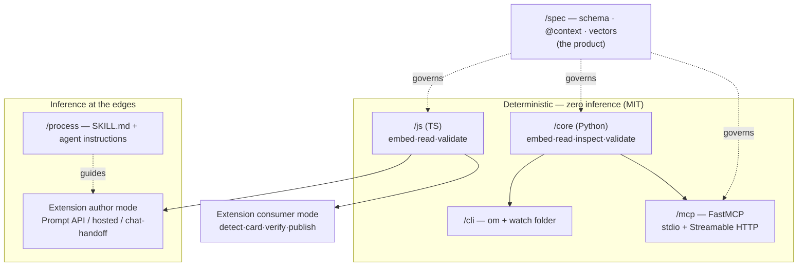
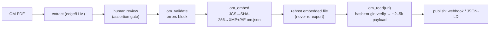
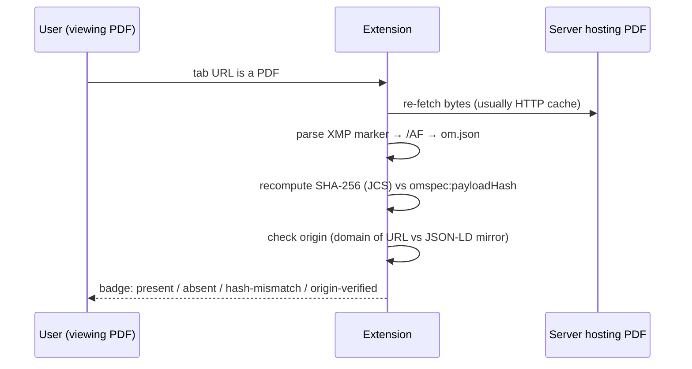

# OM Structured Data Standard + Tooling — Handoff Document

**Version:** v5.1 (2026-08-16)
**Publisher:** Vervelio
**Audience:** Scott (business) + developer + Claude Code
**Status:** Scoping complete; ready to begin Milestone 1. Decisions log §16.
**Supersedes:** v0–v4. v5 reframes the thesis provenance-first, resolves the signatures question into a four-layer model (hash + attribution + domain-origin verification + reserved signature field), adds Landscape, Non-goals, Risks, milestone definition-of-done, a glossary, and prioritized open questions. **v5.1 adds Part II — the normative specification & technical appendices (§A–§N): RFC 2119 conformance, canonicalization + hashing, exact embedded-file/XMP wire format, data dictionary, versioning policy, licensing, error taxonomy, MCP tool contracts, security & privacy, governance, telemetry, and diagrams.**

> **Document structure.** **Part I (§1–§16)** is the narrative handoff — the why, the strategy, the plan. **Part II (§A–§N)** is *normative*: it uses RFC 2119 keywords and is the contract an implementer builds against. Where the two disagree, **Part II wins.** Part II content is written to migrate verbatim into `/spec/*` files as they are created; until then it lives here so the standard is self-contained.

> **Name note:** "OpenOM" is a **working title, not locked.** The name sweep (§15 Q1) is P0 — it gates `@context`, PyPI/npm imports, and the org/domain reservation. Everything below uses "OpenOM"/`SPEC-DOMAIN-TBD` as placeholders.

---

## TL;DR (for Scott)

- **What:** An open standard that embeds a small, broker-asserted data payload *inside* the OM PDF (and mirrors it as JSON-LD on the web), so every downstream party reads the deal's key facts instead of re-typing them out of a 40-page document.
- **Why:** The broker asserts the facts once, attributably and tamper-evidently; everyone downstream — buyers, brokers, lenders, AI agents — consumes them cheaply and consistently. It also catches the OM's own math errors before anyone else sees them.
- **The ask:** ~15 real OMs from you (across producers) to build and test against; a name decision; and a call on the free-vs-paid line before Milestone 3.
- **Status:** Nothing built yet. Repo initialized. First code is the deterministic PDF round-trip (embed → read) on 3 real OMs.

---

## Glossary

| Term | Meaning |
|---|---|
| **OM** | Offering Memorandum — the marketing/deal PDF a listing broker produces for a property. |
| **STNL** | Single-Tenant Net Lease — one tenant, net-lease structure. v0.1 scope. |
| **N / NN / NNN** | Net-lease grades by how many expenses the tenant covers (taxes, insurance, maintenance). NNN = tenant covers all three. |
| **NOI** | Net Operating Income — income after operating expenses; the numerator of the cap rate. |
| **noiType** | Whether NOI is **in-place** (actual, current leases) or **pro-forma** (projected). The disclosure most accuracy disputes hinge on. |
| **Cap rate** | NOI ÷ price. The core valuation ratio. |
| **JSON-LD** | JSON for Linked Data — JSON with a shared vocabulary (`@context`) so machines agree on field meaning. |
| **`@context`** | The URL(s) defining the vocabulary a JSON-LD payload uses (schema.org + our custom namespace). |
| **Factur-X / ZUGFeRD** | Franco-German e-invoicing standard: structured XML embedded in a PDF/A-3. The precedent we borrow the embedding mechanism from. |
| **/AF, AFRelationship** | PDF "Associated Files" mechanism — how an attachment is bound to a document with a declared relationship (`Data`). |
| **XMP** | PDF metadata block; we store spec name, version, payload filename, and payload hash here. |
| **SMask** | Soft mask — the alpha/transparency channel of a PDF image; must be recombined to recover RGBA. |
| **PDF/A-3** | Archival PDF profile that permits arbitrary embedded files. Our embedding is PDF/A-3-*style* (relaxed conformance in v1). |
| **MV3** | Manifest V3 — the current Chrome extension platform. |
| **Presigned upload** | A time-limited URL that lets a client upload a file directly to storage without server credentials. |

---

## 1. What this is

An open (MIT) standard + toolchain that embeds a machine-readable, broker-asserted data payload inside commercial real estate offering memorandum PDFs, and exposes the same payload as JSON-LD on the web. One assertion at the source, infinite cheap, consistent consumption downstream.

Deliverables from one codebase:
1. **Engine** — Python library + CLI (deterministic PDF/data verbs)
2. **MCP server** — dual transport (stdio + hosted Streamable HTTP), works in any MCP client
3. **Process layer** — Claude Skill + generic agent-instructions file (the extraction playbook)
4. **JS subset** — TypeScript package: embed/read/validate, powering the Chrome extension
5. **Chrome extension** — dual persona: author mode (broker embeds) + consumer mode (anyone detects, views, routes payloads)

---

## 2. Vision & strategic thesis (the "why" — do not lose this)

**The problem.** OMs are human-readable PDFs. Every consumer — buyer, buyer's broker, lender, analyst, LLM agents — re-extracts the same facts (price, cap rate, NOI, lease terms) from scratch. A 40-page OM through a vision model is ~30–80k tokens, slow, lossy. Multiply by every party on every deal. Worse, each re-extraction can read the document differently — there is no single, authoritative, attributable version of the deal's own numbers.

**The move.** Embed a canonical, broker-asserted payload in the PDF itself, and mirror it as JSON-LD on the web. Precedent: Factur-X / ZUGFeRD — structured data embedded in PDF/A-3, which went from open spec to legal e-invoicing mandate. Same move for CRE OMs.

### The thesis, provenance-first

1. **Provenance is the durable value: broker-asserted, attributable, tamper-evident.** The payload is a named party's stated position on the deal, tied to a date, carried inside the document and verifiable at its source. "Attributable + tamper-evident" here means: you can tell *who published it*, *when*, and *that it hasn't been altered since* — **not** that anyone signs it cryptographically (see §10 for exactly what each layer proves, and what it doesn't). This value does not decay.

2. **Token asymmetry is the immediate hook.** The listing broker pays extraction once (~20–60k tokens in their existing AI client, or free on-device via the extension). Every downstream agent forever reads a ~2–5k broker-asserted payload. *"Make your deal legible to the buy-side's AI."* Token costs fall every year, so this is the reason they *try* it — provenance is the reason it *lasts*.

3. **The spec is the product; the tool is a commodity.** What compounds: versioned schema, JSON Schema validator, vocabulary namespace, governance, conformance tests. Ship `omspec 0.1` *with* the tool.

4. **Two-sided flywheel.** Author mode creates supply; consumer mode creates visible demand — buy-side tools lighting up on embedded OMs give listing brokers a reason to embed, and give buyers' brokers a reason to *ask* for embedded OMs.

**End state.** (a) Agents check for the payload first; vision fallback only on unembedded docs. (b) The standard becomes the substrate for a distributed, free-market MLS — JSON-LD listing pages + embedded payloads, crawlable by anyone, no central gatekeeper. Consumer-mode "submit to index" means the registry builds itself from the demand side (§11). Prerequisite for that stage: stronger provenance (§10) — an open MLS with no origin verification is a spam magnet.

**Neutrality.** Published under Vervelio, not Fortis. Fortis = first adopter, seed corpus, reference consumer (via Phil).

---

## 3. Landscape & positioning (who else, and why this is open)

The first question any stakeholder asks is "who else does this, and why hasn't it been done?" Short answer: adjacent players standardize *data* or *extract* it — none **embed an attributable payload at the source and verify it at the point of consumption.** That gap is the wedge.

| Player / category | What they do | What they don't do (our wedge) |
|---|---|---|
| **OSCRE, RESO** | Define CRE/residential data models and vocabularies. | Don't touch the document; no embed, no in-file provenance. We *align* with their names for credibility, borrow, don't adopt wholesale. |
| **Buildout, SharpLaunch, RCM/LightBox** | OM production + listing platforms. | Produce the PDF; don't embed structured data in it. Natural distribution partners later (§4d), not competitors to the spec. |
| **Extraction tools (Dealpath / Primer / V7 / vision-model pipelines)** | Pull structured data *out of* OMs into their own systems. | Every consumer re-extracts into a walled garden; nothing is asserted at the source or shared. We move the extraction to the source, once. |
| **Factur-X / ZUGFeRD** | Embedded structured data in PDFs for e-invoicing; open spec → legal mandate. | Not real estate. The precedent we borrow the mechanism and the open-standard playbook from. |

**Positioning stance:** OpenOM is the *interoperability layer*, not another extractor or platform. We're OSCRE-aligned on vocabulary, Factur-X-derived on mechanism, and neutral on governance (Vervelio). The thing that is ours and defensible: **attributable provenance embedded in the document + verified at the point of consumption**, plus the first properly modeled **rent schedule** (§6d).

---

## 4. The canonical workflow loop (adoption motion)

> **Generate OM → run it through the tool → rehost the embedded OM.**

Design consequences:
1. **Near-zero friction.** One command / one click / one agent instruction; slots behind existing OM producers unchanged.
2. **Non-destructive embed.** Visually identical output; preserves quality, bookmarks, links; no content recompression.
3. **Idempotent update semantics.** Price reductions are the most common re-embed event. Re-embed *replaces* the payload (never stacks), bumps `assertedDate`, records `supersedes` = prior payload hash. Repricing is a first-class operation — and note it involves **no signing step** (§10), so it stays a one-click op.
4. **Survival rules.** Attachments survive hosting, download, email, cloud storage. Destroyed by re-export, "print to PDF," flattening, aggressive optimizers. **Rehost the embedded file itself; never re-export.** `om_inspect(url)` verifies survival.
5. **Rehosted URL = crawl surface.** `om_read(url)` works for any agent; same payload emitted as JSON-LD in listing-page markup. This rehosted URL is also what makes **domain-origin verification** free (§10).

### Future scope: the in-document badge (parked, captured)
Small visual mark on the OM (footer of page 2 or cover) — Factur-X logo convention. Opt-in flag only. Overlay stamp, spec name + version, possibly QR to public validator. Consumer-mode link badging (§5b) achieves much of this without modifying the document.

---

## 5. Integration surfaces (getting into their build process)

Four surfaces, lowest friction → deepest integration.

### 5a. CLI / watch folder (ships with engine, free)
`om embed` in a script/CI, or a watcher on an "OM outbox" folder — coordinator exports into the folder, embedded file appears in "ready." Zero UI. Also the server-side path for platforms.

### 5b. Chrome extension (the human-facing surface — two personas)

MV3. Shared foundation: `/js` subset (pdf-lib embed/read, ajv validate, pdf.js text), side panel UI, chrome.storage.sync settings.

#### Consumer mode (ships first — fully deterministic, no inference)
*Anyone browsing encounters an embedded OM; the extension detects, displays, verifies, routes.*

- **Detection mechanics:** content scripts cannot inspect Chrome's built-in PDF viewer internals. Instead the extension knows the URL of the viewed PDF, re-fetches the same bytes itself (typically from HTTP cache — no real second download), and parses with the JS subset (EmbeddedFiles + /AF + XMP marker). Same UX, different plumbing. **Detection re-fetches bytes; it never scrapes the viewer.**
- **Trigger:** tab URL is a PDF → auto-check (setting, with size cap) or check-on-panel-open. Toolbar badge: payload present / absent / hash-mismatch / **origin-verified** (§10).
- **Payload card (side panel):** instant deal screen — address, price, cap, NOI + noiType, tenant, guarantor, remaining term, options — plus assertedBy/assertedDate, hash + origin verification status, validation warnings. The "40 pages → 4 seconds" demo moment.
- **Publish (routing) — v1 is deliberately simple:**
  - **Generic webhook:** POST payload JSON to any URL + optional bearer token. Covers Zapier/Make/n8n → every CRM, Sheets, Slack, Airtable — zero connectors built.
  - **Copy JSON / download .json.**
  - **No presets, by design.** Every brokerage has a different database; the webhook is the universal adapter. Users configure multiple named webhooks with a test-fire button. Phil is simply a webhook URL Fortis brokers configure — neutral in code, first-party in usage.
  - **Webhook envelope + security contract** (receiving systems build against this; version it with the spec):
    ```json
    {
      "event": "om.payload.published",
      "publishedAt": "2026-08-15T14:00:00Z",
      "sourceUrl": "https://example.com/om.pdf",
      "verification": { "hashValid": true, "originVerified": null, "signatureValid": null },
      "specVersion": "0.1",
      "envelopeVersion": "1",
      "payload": { "…the om.json…": "…" }
    }
    ```
    Security requirements for the envelope:
    - **HMAC-sign the request body** with a per-webhook shared secret; send the signature and the `publishedAt` timestamp in headers. Receivers verify before trusting.
    - **Replay protection:** receivers reject envelopes whose timestamp is outside a short window (e.g. ±5 min) and/or a seen-nonce.
    - **Versioning:** `envelopeVersion` bumps independently of `specVersion`. Additive fields only within a major version; receivers must tolerate unknown fields.
  - **Future: "Submit to index"** — consumer extensions surface embedded OMs into the public registry (opt-in; hash- and origin-verified, later signature-verified). See §11.
- **Link-level detection (optional, per-domain opt-in):** content script badges PDF *links* on listing pages via an HTTP Range request on the file tail (cheap heuristic; confirmed on click). Opt-in, cache results.
- **Local files:** require the user's "Allow access to file URLs" toggle — onboarding step, documented.

#### Author mode (ships second — needs extraction assist)
*Listing broker captures, extracts, reviews, asserts, embeds.*

- **Capture:** download interception (buildout.com + user-added domains) → toast; context menu / toolbar on any PDF.
- **Flow:** extract → **review/edit fields** → validate (errors block, warnings inform) → **Assert & Embed** → save for rehosting.
- **Three extraction paths (ship progressively):**
  1. **Local-only (free, private):** Chrome built-in Prompt API (Gemini Nano, on-device), schema-constrained JSON; doc never leaves the machine. Answers the #1 objection: "I'm not uploading my unreleased OM to someone's server." Weaker on messy rent schedules — review panel + consistency warnings are the net. Verify Prompt API limits at build time.
  2. **Hosted extraction (commercial tier candidate):** presigned upload → Vervelio endpoint, real-model extraction → draft into same review panel. Best accuracy; natural front-end for the paid tier (§15 Q2).
  3. **Chat handoff (their subscription):** upload blob → deep-link into their chat client → their logged-in assistant drives our MCP connector. *The assistant drives the tool; we never drive the assistant.*
- **HARD RULE — no chat-UI puppeteering.** No injecting into / scraping logged-in ChatGPT/Claude sessions: ToS, fragility, account risk. Paths 1–3 achieve the outcome legitimately.
- **Review panel = the assertion gate.** Extraction output only *becomes* a broker assertion when a human reviews and clicks Assert & Embed.

**Architecture impact:** the TS subset (embed/read/validate) is required (`/js`); extraction stays wherever inference lives.

### 5c. Agentic browsers (Claude in Chrome, etc.)
In-browser agents run the loop as a shortcut/Skill against the MCP. Document in `/process`; no bespoke surface.

### 5d. Buildout partnership / API (endgame for this channel)
One native integration = thousands of brokerages embedding at export. Approach as Vervelio (neutral steward), not Fortis. Extends to SharpLaunch, RCM/LightBox, in-house shops via 5a. Timing: after 0.1 + tooling + traction.

---

## 6. Architecture

### 6a. Layers, one repo

| Layer | Form | Purpose | Distribution |
|---|---|---|---|
| Engine | Python lib + CLI, MIT | Deterministic verbs | GitHub (Vervelio org) + PyPI |
| MCP server | Thin wrapper, dual transport | Agent access, any client | stdio (pipx) + hosted Streamable HTTP (Vervelio) |
| Process layer | SKILL.md + agent instructions | Extraction/mapping playbook | Skill (Claude) + AGENTS-style doc |
| JS subset | TS: embed/read/validate | Extension + web/Node consumers | npm |
| Extension | MV3, consumer + author modes | Detect/view/publish + capture/review/embed | Chrome Web Store (Vervelio) |

**Cardinal rule: the open server, the core, and consumer-mode JS stay deterministic — zero inference, ever.** No keys, no per-call costs, trivial hosting, testable. LLM mapping runs client-side or on-device, guided by the process layer. Hosted inference-included extraction, if offered, is a separate commercial service — never the open server.

### 6b. Client compatibility target

| Client | Transport | Notes |
|---|---|---|
| Claude (web/desktop/mobile) | remote; desktop also stdio | + Skill |
| Claude Code / Cowork | stdio + remote | primary dev surface |
| ChatGPT | remote only | why remote ships at launch |
| Gemini (CLI) | stdio + remote | web-app connectors: verify |
| Copilot (VS Code agent mode) | stdio + remote | |
| Local LLMs (LM Studio, Continue, LibreChat…) | stdio | |
| Chrome (extension) | n/a — JS subset; Prompt API / hosted / chat-handoff | §5b |

### 6c. Token model
Server: zero inference, no keys. Client cost = context tokens on tool outputs; subscription users see normal usage limits, no API billing; extension local/consumer paths: zero tokens. Heavy op = one-time embedder extraction; consumers get ~2–5k `om_read`. Tools return compact outputs — text paginates, images return manifests + links.

### 6d. Remote file I/O
Remote can't reach client filesystems: tools accept HTTPS URL or presigned upload (→ blob id); outputs as download links, payload inline. stdio: plain paths. Path-or-URL polymorphic. Blobs: R2. Retention policy needed (§15 Q4).

---

## 7. The spec (design philosophy first)

### 7a. Assertions, not facts
An OM is an advocacy document: broker opinion of value + seller expectations. The payload encodes **assertions by an identified party as of a date**:
- `assertedBy` (broker, brokerage, license #) + `assertedDate` **required**.
- `noiType: "in-place" | "pro-forma"` **required** + `noiAsOfDate` — forces the disclosure most accuracy disputes are actually about.
- Labels derivable, not asserted: `landlordResponsibilities` boolean set (roof, structure, parking, HVAC, taxes, insurance, CAM) makes lease type *derivable and disputable* — kills "everything is NNN."
- **Per-field provenance tag.** Each substantive field carries a `source` of `asserted` (broker stated it), `extracted` (pulled from the doc, unreviewed), or `verified` (checked against an authoritative source). This operationalizes "assertions, not facts" at the field level and lets consumers weight fields. Default on embed is `asserted` (the review gate makes it so).
- Payloads SHOULD be human-reviewed before embed (extension review panel operationalizes).
- Tooling checks internal consistency, never market truth (§9).

### 7b. Format & governance
- **JSON-LD only** (XML dropped — no identified consumer).
- `@context`: schema.org (`RealEstateListing`, `Offer`, `Place`, `PostalAddress`, `Organization`) + custom vocab (capRate, noi, rentSchedule, guarantor, options…). Rent schedules unmodeled anywhere else = the opportunity.
- `"specVersion": "0.1"` + published JSON Schema.
- Borrow RESO/OSCRE names for credibility; don't adopt wholesale.
- Name TBD — reserve GitHub org + PyPI + npm + Chrome Web Store + domain as a set before code (§15 Q1, P0).

### 7c. v0.1 scope (confirmed)
STNL, N through NNN, retail/QSR/pharmacy. Multi-tenant/industrial/office later.

### 7d. Field sketch (moving toward the real schema)
- **Property:** address (parsed + geo), APN, building SF, lot, year built/renovated.
- **Deal:** asking price, cap rate, NOI + noiType + noiAsOfDate, price/SF, status.
- **Lease:** tenant entity, guarantor + type, `landlordResponsibilities` booleans, asserted lease type, commencement, expiration, remaining term, **`rentSchedule`** (modeled below), escalations, options, ROFR/ROFO.
- **Parties:** listing broker(s), brokerage, license #s, contact.
- **Meta:** specVersion, assertedBy, assertedDate, sourceDocHash, supersedes, **`signature` (optional, reserved — see §10)**, imageRights (optional).

**Modeled `rentSchedule`** (the differentiator — it must be a real object, not prose). Each period:
```json
{
  "periodStart": "2024-05-01",
  "periodEnd": "2029-04-30",
  "annualRent": 115625,
  "monthlyRent": 9635.42,
  "rentPSF": 12.70,
  "escalationFromPrior": 0.10,
  "abatement": null,
  "source": "asserted"
}
```
Rules: periods are contiguous and non-overlapping (a consistency warning fires otherwise, §9); `rentPSF` derivable from `annualRent ÷ buildingSF` (mismatch → warning); `escalationFromPrior` cross-checks against the prior period's `annualRent`.

### 7e. Sample payload (illustrative — fictional deal)
```json
{
  "@context": ["https://schema.org", "https://SPEC-DOMAIN-TBD/ns/0.1"],
  "@type": "RealEstateListing",
  "specVersion": "0.1",
  "assertedBy": { "broker": "Jane Example", "brokerage": "Example Net Lease Advisors", "license": "MI 6501-000000" },
  "assertedDate": "2026-08-15",
  "property": {
    "address": { "streetAddress": "1000 Example Rd", "addressLocality": "Sampleville", "addressRegion": "MI", "postalCode": "48000" },
    "geo": { "latitude": 42.0, "longitude": -83.0 },
    "apn": "00-000-000-000", "buildingSF": 9100, "lotAcres": 1.25, "yearBuilt": 2019
  },
  "deal": { "askingPrice": 1850000, "capRate": 0.0625, "noi": 115625, "noiType": "in-place", "noiAsOfDate": "2026-06-30", "status": "active" },
  "lease": {
    "tenantEntity": "Example Retail Stores, LLC",
    "guarantor": { "name": "Example Retail Corp.", "type": "corporate" },
    "landlordResponsibilities": { "roof": false, "structure": false, "parking": false, "hvac": false, "taxes": false, "insurance": false, "cam": false },
    "leaseTypeAsserted": "NNN",
    "commencement": "2019-05-01", "expiration": "2034-04-30",
    "rentSchedule": [
      { "periodStart": "2024-05-01", "periodEnd": "2029-04-30", "annualRent": 115625, "rentPSF": 12.70, "source": "asserted" },
      { "periodStart": "2029-05-01", "periodEnd": "2034-04-30", "annualRent": 127188, "rentPSF": 13.98, "escalationFromPrior": 0.10, "source": "asserted" }
    ],
    "options": [ { "count": 4, "lengthYears": 5, "escalation": "10% per option" } ]
  },
  "meta": { "sourceDocHash": "sha256:…", "supersedes": null, "signature": null }
}
```

---

## 8. PDF mechanics

### 8a. Embedding
- `om.json` as PDF embedded file + /AF, `AFRelationship = Data` (Factur-X mechanism). XMP block: spec name, version, payload filename, payload hash.
- Pragmatic v1: PDF/A-3-*style*, strict conformance later.
- **Update semantics:** detect existing → replace attachment, update XMP, set `supersedes`. Never duplicate.
- Consumer path: /AF + XMP → attachment → schema validate. Fallback: full extraction.
- **Cross-implementation round-trip test:** pdf-lib output readable by pikepdf and vice versa, byte-for-byte payload fidelity. The kind of bug that silently kills a standard — named test from day one.

### 8b. Image extraction (settled: yes, no rendering)
Raster images = Image XObjects; extraction = locate + decompress (PyMuPDF primary; poppler `pdfimages -list` cross-check). Handle: SMasks (→RGBA), CMYK/ICC→sRGB, tiled/striped images (InDesign), dedupe by xref, vector content (paths → render fallback only), scanned/flattened (full-page image per page). `om_inspect` classifies native/hybrid/scanned up front. Third-party photo licenses → imageRights field.

### 8c. Libraries
Python: pikepdf, PyMuPDF, jsonschema, typer, FastMCP. JS: pdf-lib, ajv, pdf.js.

---

## 9. MCP tool surface + validation philosophy

| Tool | Signature | Notes |
|---|---|---|
| `om_inspect` | pdf(path\|url) → profile | class, pages, payload present + version?, image inventory, text coverage |
| `om_extract_text` | pdf, page_range → text + tables | paginated |
| `om_extract_images` | pdf → manifest + links/paths | SMask, dedupe, colorspace |
| `om_read` | pdf(path\|url) → payload \| null | hash + origin verify; the cheap consumer path |
| `om_validate` | payload → report | two-tier below |
| `om_embed` | pdf, payload → new pdf | invalid = refuse; warnings never block; §8a semantics |

### Validation: two tiers, hard boundary
1. **Errors (block):** JSON Schema violations. (Schema ships in M2.)
2. **Warnings (never block):** internal consistency — NOI ÷ price vs cap rate, rent-schedule sums and contiguity, date/term arithmetic, price/SF, continuity. Self-contradiction is data-quality regardless of opinion.
3. **Out of scope forever:** market truth (§10 Non-goals).

**Validator as trojan horse — split, not deferred.** The consistency-warning tier is schema-independent and independently valuable (OMs fail their own math constantly). Ship it as a **standalone free checker early**, before anyone cares about embedding — it's the cold-start lever. The schema-error tier lands with M2 when the schema exists. Do not force an artificial "M1.5"; the two tiers simply mature on different milestones.

Orchestration: inspect → extract → agent/on-device maps → human review → validate → embed → rehost → (consumer: detect → verify → publish).

---

## 10. Trust / provenance — the four-layer model (resolved)

Provenance is the thesis (§2), so this section is load-bearing. The design deliberately **requires no cryptographic signing at day one or at re-embed.** Each layer proves exactly one thing; be honest about what each does *not* prove.

| Layer | Ships | Proves | Does NOT prove |
|---|---|---|---|
| **1. Embedded hash** (in XMP) | Day one | The payload has not been altered since embed; travels inside the file everywhere. | Who created it; that it wasn't re-embedded by someone else. |
| **2. Self-asserted identity** (`assertedBy` + license + date) | Day one | The *claim of authorship* is on the record, tied to a named party and license #. | That the identity is real (nothing verifies the license by itself). Honestly labeled **unverified**. |
| **3. Domain-origin verification** (read-time) | With consumer mode (M5a) | That the OM is published at, and its JSON-LD mirror served from, a specific domain — "asserted by whoever controls this domain," via HTTPS/DNS, the web's own trust model. Free, because consumer mode already has the URL. | The legal identity behind the domain; survives poorly if the file is rehosted elsewhere (which is arguably correct — verification is meaningful at origin). |
| **4. Signature** (optional field, reserved) | Field reserved day one; verification is registry-era | Cryptographic authorship + integrity once a key infrastructure exists. | Nothing yet — reserved and empty in 0.1. |

**Why this design (the Scott-aligned reasoning):**
- A signature proves *who* and *unaltered-since*, not *true*. It does nothing against the broker who mislabels the deal (the "ice-cream stand posted as a Walgreens" problem) — that is content falsehood, and **market truth is out of scope forever** (§ Non-goals). So signing is not the tool for the problem brokers worry about.
- What actually deters the mislabeler is **attribution**: the claim is on the record under a named license (layer 2), and verifiable to a domain (layer 3). Accountability, not encryption.
- Signing would add real friction to the **most common operation** — repricing/re-embed — because a private key would have to be present at every export/CI/watch-folder run. Hash recompute is free and already happening.
- The one thing we do now for the future: **reserve the optional `signature` field in the 0.1 schema.** It costs nothing today and avoids a breaking `@context` change later. Require nothing; build no verification; ship it `null`.

**Roadmap.** Day one: layers 1–2, plus layer 3 as consumer mode ships. Registry era (§11): layer 4 graduates from reserved to verified, because an open index of valuable listings is where *impersonation* (dishonest identity) finally becomes a real threat that signatures actually solve.

---

## Non-goals (consolidated — do not re-litigate)

These are settled and permanent unless a decision-log entry reverses them:
- **Market truth.** Tooling never judges whether a deal's claims are accurate — only internal consistency. Consuming LLMs editorialize anyway; the spec takes no position.
- **No inference in the open server, the core, or consumer mode — ever.** No keys in those layers.
- **No chat-UI puppeteering.** Never inject into or scrape logged-in ChatGPT/Claude sessions. Use MCP connectors / on-device / hosted paths.
- **No viewer scraping.** Detection re-fetches PDF bytes; it never inspects the browser's PDF viewer internals.
- **No re-export.** Rehost the embedded file itself; re-export destroys the attachment.
- **No silent visual modification.** Output PDF is visually identical unless an explicit badge flag is set.
- **No required cryptographic signing in 0.1.** The field is reserved; signing is registry-era (§10).

---

## 11. Adoption strategy summary
1. **Provenance + embedder-pays-once** (§2) — durable value first, token asymmetry as the hook.
2. **Validator as trojan horse** (§9) — standalone consistency checker seeds usage before embedding matters.
3. **Consumer mode creates visible demand** (§5b) — buy-side lights up on embedded OMs; buyers' brokers start *asking*.
4. **Extension makes authoring one click; local path removes the confidentiality objection** (§5b).
5. **Publish/webhook makes payloads immediately useful** — into CRMs/Sheets/Phil day one.
6. **Fortis seeds supply; Phil is the reference consumer** — wired in as an ordinary webhook.
7. **Buildout + peer integrations** (§5d).
8. **Badges** — link-level (consumer mode, no doc changes) now-ish; in-document overlay later.
9. **Neutral governance under Vervelio**, OSCRE-aligned vocabulary (§3).

### Trust roadmap (see §10 for the model)
- Day one: hash + self-asserted identity; domain-origin verification with consumer mode.
- Registry era: signatures graduate; index = the free-market MLS, crowd-sourced from the demand side via consumer-mode "submit to index" (opt-in; hash + origin + signature verified → spam-resistant). Anyone can build an index; Vervelio/Phil builds the reference.

---

## 12. Risks & mitigations

| Risk | Likelihood / Impact | Mitigation | Owner |
|---|---|---|---|
| **Cold-start — no supply, no demand** | High / High | Ship the standalone consistency validator first (value with zero embedding); consumer mode manufactures visible demand; Fortis seeds supply. | Scott + dev |
| **Cross-impl round-trip bug** (pdf-lib ↔ pikepdf payload drift) | Medium / Fatal to a standard | Named cross-implementation round-trip test from day one (§8a); byte-for-byte payload fidelity in CI. | Dev |
| **Fixture skew** (all one producer → messy cases untested) | Medium / High | Spec a fixture *matrix* (producers × pathologies), not a count; block M1 exit until the matrix is filled. | Scott (sources) + dev |
| **Name squatting / unavailable across registries** | Medium / High (rework + brand) | P0 name sweep across org+PyPI+npm+Web Store+domain *as a set* before any `@context` or import (§15 Q1). | Scott |
| **Trust over-sold** (hash read as authenticity) | Medium / Medium | Four-layer model states what each proves and doesn't (§10); UI shows distinct hash vs origin vs signature states. | Dev |
| **Incumbent capture** (Buildout/CoStar clones it closed) | Low–Med / High | Open MIT spec + neutral Vervelio governance + first-mover corpus; approach Buildout as partner, not competitor. | Scott |
| **Detection edge cases** (object streams hide EmbeddedFiles; viewer variance) | Medium / Medium | Re-fetch + full parse fallback; Range-request heuristic is best-effort, confirmed on open; cache. | Dev |
| **Confidentiality objection** (won't upload unreleased OM) | High / High | On-device local extraction path (Prompt API); doc never leaves the machine. | Dev |
| **Free/paid line drawn too late** | Medium / High (refactor across the boundary) | Decide before M3; ideally settle at M1 (§15 Q2). | Scott |

---

## 13. Future scope (parked, not forgotten)
In-document badge overlay (§4) · signature verification + key infra (§10) · registry + submit-to-index (§11) · named publish connectors (HubSpot/Salesforce/Sheets) · multi-tenant/industrial/office spec versions · strict PDF/A-3 · XMP mirror fields for dumb crawlers · hosted inference tier (§15 Q2) · sidecar convention (§15 Q5) · Buildout + peer native integrations · Firefox/Edge ports (check Prompt API availability).

---

## 14. Development plan (Claude Code handoff) — with definition-of-done

Each milestone has a **technical DoD (gates the milestone)** and an **adoption DoD (tracked, does not gate — it depends on parties we don't control).**

**Repo layout:** `/core` (Python) · `/cli` · `/mcp` · `/process` · `/spec` · `/js` (TS subset) · `/extension` (MV3, consumer + author) · `/fixtures`.

**Fixtures before extraction logic.** A *matrix*, not a count: producers (InDesign, Word-to-PDF, Buildout, scanned) × pathologies (messy rent schedule, CMYK/SMask images, flattened scan, empty payload, hash mismatch). 10–15 real OMs covering the matrix. (Scott sources.) M1 does not exit until the matrix is filled.

| Milestone | Technical DoD (gate) | Adoption DoD (tracked) |
|---|---|---|
| **M1 — round trip (stdio)** | inspect + extract_images + embed/read on 3 real OMs (native/hybrid/scanned); non-destructive, idempotent re-embed w/ `supersedes`, survival through download/re-upload; cross-impl round-trip test green. | 3 real Fortis OMs embedded and re-read successfully. |
| **M1.x — standalone validator** | Consistency-warning checker (schema-independent) runs on any payload/OM; catches NOI/cap, schedule sums+contiguity, date math. | ≥1 broker runs it to catch a real error before caring about embedding. |
| **M2 — schema + validate** | JSON Schema 0.1 published; two-tier validate (errors block / warnings inform); samples in `/spec`; per-field `source` tags; reserved `signature` field. | Schema referenced by an external reader. |
| **M3 — remote transport** | Streamable HTTP; URL + presigned upload; R2; link outputs. Free/paid line decided by here. | ChatGPT/web client reads a payload via hosted MCP. |
| **M4 — process layer** | SKILL.md + generic instructions; end-to-end in Claude + one non-Claude client. | A non-Claude client completes the full loop. |
| **M5a — extension consumer mode** | `/js` read/validate (+ cross-impl test vs pikepdf); MV3 detection (re-fetch on viewed PDFs, toolbar badge); payload card; domain-origin verification; named-webhook publish (envelope + HMAC) + test-fire + copy/download. No model anywhere. | 10 real OMs embedded and read by an external tool/user via the extension. |
| **M5b — extension author mode** | Download interception (Buildout + custom); side-panel review; local extraction via Prompt API; hosted path stubbed behind Q2; embed via `/js`. | A broker embeds an OM end-to-end without touching the CLI. |

**Suggested first Claude Code prompt (M1):** "Read `/spec` and this handoff doc. Scaffold `/core` with pikepdf-based embed/read (EmbeddedFiles + /AF AFRelationship=Data + XMP block w/ spec name/version/hash), PyMuPDF-based inspect (native/hybrid/scanned classification) and image extraction (SMask recombine, xref dedupe, CMYK→sRGB). Idempotent re-embed with `supersedes` hash. pytest round-trip against `/fixtures`. No LLM calls anywhere in `/core`."

**Standing rules for dev:** no inference in the open server, core, or consumer mode, ever · tools return compact outputs · never modify visual content without an explicit flag · every payload change bumps `assertedDate` · no automation of third-party logged-in sessions · detection re-fetches bytes, never scrapes the viewer · no signing required at embed/re-embed (§10).

---

## 15. Open questions (prioritized + assigned)

| # | Question | Priority | Blocks | Owner |
|---|---|---|---|---|
| Q1 | **Name sweep** — GitHub org + PyPI + npm + Chrome Web Store + domain as a set. Candidates: OpenOM, omspec, ListingLD. | **P0** | `@context`, all imports, org reservation | Scott |
| Q2 | **Free/paid boundary** — engine/MCP/extension local+consumer = free MIT; hosted inference extraction = commercial? | P0 | M3 (ideally settle at M1) | Scott |
| Q3 | **Fixture matrix** — which producers × which pathologies, concretely. | P1 | M1 exit | Scott + dev |
| Q4 | **Blob storage + retention** (R2) — expiry for unreleased OMs. | P1 | M3 | Dev |
| Q5 | **Sidecar convention** — `om.json` beside `om.pdf`? | P2 | M5a (nice-to-have) | Dev |
| Q6 | **Build-time verifications** — Gemini web connectors · Prompt API limits + structured output · chat prefill deep-links per client · Web Store publishing under Vervelio · Prompt API on Edge. | P1 | M5a/M5b | Dev |
| Q7 | **XMP mirror fields** for dumb crawlers. | P2 | future | Dev |
| Q8 | **Consumer-mode defaults** — auto-check every viewed PDF (size cap) vs check-on-open? Link-badging per-domain opt-in? Cache TTL? | P2 | M5a | Dev |
| Q9 | **Index submission consent model** (registry era) — what is shared, when. | P3 | registry | Scott + dev |

---

## 16. Decisions log
| Date | Decision | Rationale |
|---|---|---|
| 2026-08-15 | Layered architecture, one repo | Deterministic engine ≠ LLM process |
| 2026-08-15 | Python core (pikepdf + PyMuPDF) | PDF tooling maturity |
| 2026-08-15 | Factur-X-style PDF/A-3 embedding, relaxed v1 | Proven mechanism |
| 2026-08-15 | JSON-LD, schema.org + custom vocab, versioned + JSON Schema | Spec is the product |
| 2026-08-15 | XML dropped | No identified consumer |
| 2026-08-15 | v0.1 = STNL, N/NN/NNN | Most standardized; Fortis seeds |
| 2026-08-15 | Published under Vervelio | Neutral governance |
| 2026-08-15 | Dual transport; hosted Streamable HTTP | ChatGPT/web reach |
| 2026-08-15 | Zero inference server-side | No keys/costs |
| 2026-08-15 | Validator = errors + consistency warnings; never market truth | Assertions, not facts |
| 2026-08-15 | noiType + asOfDate required; assertedBy/Date framing | Opinion-not-fact in the spec |
| 2026-08-15 | landlordResponsibilities booleans | Kills "everything is NNN" |
| 2026-08-15 | Workflow = generate → embed → rehost; idempotent updates | Repricing is the common case |
| 2026-08-15 | In-document badge = future, opt-in | Never silently modify visuals |
| 2026-08-15 | Chrome extension = primary human-facing surface | One-click authoring + detection |
| 2026-08-15 | HARD RULE: no chat-UI puppeteering | ToS, fragility, account risk |
| 2026-08-15 | TS subset required | Extension needs in-browser engine |
| 2026-08-15 | Review-before-embed = spec SHOULD; review panel = assertion gate | Extraction → assertion via human |
| 2026-08-15 | Extension consumer mode ships before author mode | Fully deterministic; demo-able earlier |
| 2026-08-15 | Detection via re-fetch of the PDF URL, never viewer inspection | Viewer internals inaccessible |
| 2026-08-15 | Publish v1 = neutral named webhooks + copy/download; NO presets | Webhook is the universal adapter |
| 2026-08-15 | Webhook envelope mini-spec, versioned with the spec | Receiving systems need a stable contract |
| **2026-08-16** | **Thesis reframed provenance-first; token asymmetry is the hook, not the durable value** | Token costs decay; attributable provenance does not |
| **2026-08-16** | **Provenance = four layers: hash + self-asserted identity + domain-origin verification + reserved signature field** | Each proves one thing; be honest about limits |
| **2026-08-16** | **No cryptographic signing required in 0.1 or at re-embed; `signature` field reserved-not-required** | Signing doesn't solve content lies, adds friction to repricing; reserving the field avoids a breaking change |
| **2026-08-16** | **Domain-origin verification is the day-one verification path** (read-time, web-native) | Free — consumer mode already has the URL; no key management |
| **2026-08-16** | **Per-field `source` tag (asserted/extracted/verified)** | Operationalizes "assertions, not facts" at field level |
| **2026-08-16** | **`rentSchedule` fully modeled with consistency rules** | The acknowledged differentiator; must be a real object |
| **2026-08-16** | **Webhook envelope gains HMAC + replay protection + independent `envelopeVersion`** | Receiving systems need a security contract, not just a shape |
| **2026-08-16** | **Validator split: standalone consistency checker early, schema-error tier with M2** | Trojan-horse value needs no schema; avoids artificial milestone |
| **2026-08-16** | **Milestone DoD is two-tier: technical gates, adoption tracks** | A milestone can't be hostage to a third party's tool existing |
| **2026-08-16** | **Payload canonicalization = RFC 8785 (JCS); integrity hash = SHA-256 over JCS bytes, stored in XMP** (§C) | Cross-impl byte-for-byte fidelity is undefinable without a canonical form |
| **2026-08-16** | **Code = MIT; spec/schema/@context/vocabulary = CC-BY-4.0** (§G) | Spec licensing is separate from code licensing and gates adoption |
| **2026-08-16** | **Stable error/warning code taxonomy (`OMV-E###` / `OMW-W###`)** (§H) | Tools and receivers must program against codes, not prose |
| **2026-08-16** | **Spec follows SemVer; published `@context` URLs are immutable** (§F) | A shipped standard's contract cannot silently change meaning |
| **2026-08-16** | **PDF `/Params/CheckSum` (MD5) is NOT the integrity mechanism; the SHA-256 in XMP is** (§C, §D) | The PDF-level checksum is legacy MD5; provenance needs SHA-256 |
| **2026-08-16** | **Zero telemetry in core, open server, and consumer mode; extension analytics opt-in only** (§M) | Matches the deterministic-core rule; adopters demand it |

---

# PART II — Normative Specification & Technical Appendices

> **These sections are normative.** The key words **MUST**, **MUST NOT**, **REQUIRED**, **SHALL**, **SHALL NOT**, **SHOULD**, **SHOULD NOT**, **RECOMMENDED**, **MAY**, and **OPTIONAL** are to be interpreted as described in **RFC 2119** and **RFC 8174** (only uppercase forms are normative). Requirements carry stable IDs (`[OM-AREA-###]`) so conformance tests map 1:1 to requirements (§B, §12-traceability).

---

## §A. Conformance conventions & requirement traceability

- **[OM-CONF-001]** An implementation claiming "OpenOM 0.1 conformant" MUST satisfy every `MUST`/`MUST NOT` in Part II that applies to the role it implements (Producer, Consumer, or Validator; §B).
- **[OM-CONF-002]** Requirement IDs are stable and append-only. A requirement MUST NOT be renumbered; if withdrawn it is marked *Deprecated* with the version that withdrew it, never deleted.
- **[OM-CONF-003]** Every normative requirement MUST have exactly one ID. Conformance-suite test cases (§B) MUST reference the ID(s) they exercise.
- **[OM-CONF-004]** Roles: **Producer** = writes payloads/embeds (CLI, `/js` author mode, `om_embed`). **Consumer** = reads/verifies (`om_read`, consumer mode). **Validator** = runs schema + consistency checks (`om_validate`, standalone checker). An implementation MAY fill multiple roles; it is judged against each role it claims.

## §B. Conformance suite & interop test vectors

- **[OM-VEC-001]** `/spec/vectors/` MUST contain canonical test vectors committed to the repo: (a) `payloads/*.json` — valid and intentionally-invalid payloads; (b) `expected/*.json` — for each payload, its JCS form, its `sha256:` hash, and its expected `om_validate` report (error/warning codes); (c) `pdfs/*.pdf` — golden embedded OMs with a sidecar `*.expected.json` describing the payload, hash, and XMP fields.
- **[OM-VEC-002]** The **cross-implementation round-trip test** MUST assert: a payload embedded by `/js` (pdf-lib) and read by `/core` (pikepdf) yields byte-for-byte identical **decompressed payload bytes** and an identical `sha256:` hash, and vice versa. This test MUST run in CI on every commit.
- **[OM-VEC-003]** A Producer MUST reproduce, for every vector in `payloads/`, the exact `sha256:` hash in `expected/`. A Validator MUST reproduce the exact code set. Divergence is a conformance failure.
- **[OM-VEC-004]** Vectors MUST cover the fixture *pathology matrix* (§14): native/hybrid/scanned PDFs, CMYK/SMask images, empty payload, hash mismatch, non-contiguous rent schedule, `pro-forma` NOI, superseded re-embed.

## §C. Canonicalization & hashing (the interop keystone)

- **[OM-CANON-001]** The canonical serialization of a payload MUST be **RFC 8785 JSON Canonicalization Scheme (JCS)**: UTF-8 encoding, **no BOM**, object keys sorted lexicographically by UTF-16 code unit, **no insignificant whitespace**, and numbers serialized per RFC 8785 §3.2.2.3 (ECMAScript `Number` shortest round-trip; no trailing zeros, no leading `+`, exponent form only per the algorithm).
- **[OM-CANON-002]** Array element order is significant and MUST be preserved (JCS sorts object keys only). `rentSchedule` order therefore carries meaning and MUST reflect chronological periods.
- **[OM-CANON-003]** The **integrity hash** is `"sha256:" + lowercase_hex( SHA-256( JCS(payload_for_hash) ) )`, where `payload_for_hash` is the full payload with `meta.signature` **removed** (not set to null — the key is absent) so that adding a signature later does not change the hash. The integrity hash MUST NOT be stored inside the payload; it lives in XMP (§D) to avoid self-reference.
- **[OM-CANON-004]** `meta.sourceDocHash` is a distinct value: `"sha256:" + lowercase_hex( SHA-256( original_source_PDF_bytes ) )` computed over the source document **before** embedding. It answers "which document does this payload describe," not "has the payload been altered." It is OPTIONAL and, when present, is part of `payload_for_hash`.
- **[OM-CANON-005]** The embedded-file stream (§D) MUST contain exactly the JCS bytes (a Producer MUST NOT pretty-print, re-key, or re-encode). Stream-level Flate compression is permitted; the hash is always computed over the **decompressed** bytes, so compression choice MUST NOT affect the hash.
- **[OM-CANON-006]** Monetary amounts are numbers in **major units** of the payload currency; whole-dollar values (e.g. `askingPrice`) SHOULD be integers; sub-unit values (e.g. per-month rent) MAY carry up to 2 decimals — but note JCS drops trailing zeros (`12.70`→`12.7`), so Producers MUST NOT rely on trailing-zero formatting for equality.
- **[OM-CANON-007]** Rates and percentages are decimal fractions: `capRate: 0.0625` means 6.25%. Producers MUST NOT encode `6.25`.

> **Why this is §C and not a footnote:** the named cross-impl round-trip test (§8a/§B) is *undefinable* without a canonical byte form. This section is the single technical dependency the whole "it's a standard, not a fork per vendor" claim rests on.

## §D. Embedded-file & XMP wire format (exact)

Grounded in the actual libraries: pikepdf `AttachedFileSpec`/`Pdf.attachments`, pdf-lib `PDFDocument.attach(..., { afRelationship: AFRelationship.Data })`.

### §D.1 Embedded file
- **[OM-EMB-001]** The payload MUST be embedded as a PDF embedded file named exactly `om.json`, referenced from the document catalog `/Names /EmbeddedFiles` name tree.
- **[OM-EMB-002]** The catalog MUST contain an `/AF` (Associated Files) array referencing the payload's `/Filespec` (Factur-X / PDF/A-3 mechanism). *Implementation note:* pdf-lib's `attach` adds `/AF` when `afRelationship` is set; pikepdf requires the `AttachedFileSpec` to carry `relationship = Name.Data` and the Producer MUST verify the `/AF` array is present on the catalog (assigning to `Pdf.attachments` alone populates `/EmbeddedFiles` but a conformant Producer MUST ensure `/AF` too).
- **[OM-EMB-003]** The `/Filespec` dictionary MUST set: `/Type /Filespec`, `/F (om.json)`, `/UF (om.json)` (both, for reader compatibility), `/AFRelationship /Data`, and `/EF << /F <stream> /UF <stream> >>`. `/Desc` is OPTIONAL.
- **[OM-EMB-004]** The embedded-file stream MUST set `/Type /EmbeddedFile` and `/Subtype` to the name-escaped MIME type `/application#2Fld+json` (i.e. `application/ld+json`). Consumers MUST also accept `/application#2Fjson` (`application/json`) for forward tolerance but Producers MUST write `application/ld+json`.
- **[OM-EMB-005]** `/Params` SHOULD include `/Size` (decompressed byte length) and `/ModDate`. The PDF `/Params /CheckSum` is defined by ISO 32000 as an **MD5** digest of the uncompressed bytes; it is legacy and **MUST NOT** be treated as the integrity mechanism. Integrity is the SHA-256 in XMP (§D.2, §C). Producers MAY write `/CheckSum` for reader compatibility; Consumers MUST ignore it for trust decisions.

### §D.2 XMP marker (detection + integrity)
- **[OM-XMP-001]** The document catalog `/Metadata` XMP stream MUST carry an OpenOM RDF description under namespace URI `https://SPEC-DOMAIN-TBD/ns/0.1#` (placeholder until §15 Q1), RECOMMENDED prefix `omspec`.
- **[OM-XMP-002]** Required XMP properties: `omspec:specName` (string, `"OpenOM"`), `omspec:specVersion` (`"0.1"`), `omspec:payloadFilename` (`"om.json"`), `omspec:payloadHash` (the §C integrity hash), `omspec:assertedDate` (ISO 8601 date). OPTIONAL: `omspec:supersedes` (prior `payloadHash`).
- **[OM-XMP-003]** Detection order for a Consumer: (1) parse XMP for `omspec:payloadHash`; (2) locate `om.json` via `/AF`→`/Filespec`→`/EF`; (3) decompress, recompute the §C hash, compare to `omspec:payloadHash`; (4) schema-validate (§E). A Consumer MUST report `hash-mismatch` if step 3 disagrees and MUST NOT treat a mismatched payload as trusted.
- **[OM-XMP-004]** Re-embed (§4 idempotency): a Producer MUST replace the existing `om.json` stream and `/AF` entry in place, update all XMP properties, set `omspec:supersedes` to the prior `omspec:payloadHash`, and MUST NOT leave a second `om.json` in `/EmbeddedFiles`.

### §D.3 Cross-implementation gotchas (normative cautions)
- **[OM-EMB-010]** Producers MUST NOT let a library re-serialize the JSON; pass the JCS bytes directly (`Pdf.attachments['om.json'] = jcs_bytes` in pikepdf; `attach(jcs_bytes, 'om.json', …)` in pdf-lib).
- **[OM-EMB-011]** `/ModDate`/`/CreationDate` differences between implementations are cosmetic and MUST NOT affect the payload hash (which covers JSON only), nor conformance.
- **[OM-EMB-012]** Filename casing MUST be exactly `om.json` (lowercase) in both `/F` and `/UF`.

## §E. Data dictionary, units & enumerations

- **[OM-DD-001]** The normative schema is `/spec/om-0.1.schema.json` (JSON Schema 2020-12). This table is the human-readable mirror; on conflict the schema wins.
- **[OM-DD-002]** Dates MUST be ISO 8601 (`YYYY-MM-DD` for dates, RFC 3339 UTC `Z` for timestamps). Currency MUST be ISO 4217; v0.1 assumes `USD` unless a top-level `currency` field states otherwise. Country/region codes MUST be ISO 3166.
- **[OM-DD-003]** **Absent vs null:** an omitted key means "not asserted"; an explicit `null` means "asserted to be not applicable / none" (e.g. `supersedes: null` = "this is an original, deliberately"). Consumers MUST distinguish the two.

| Field (path) | Type | Card. | Units/Format | Req? | `source` tag |
|---|---|---|---|---|---|
| `specVersion` | string enum `"0.1"` | 1 | — | MUST | n/a |
| `assertedBy.broker` / `.brokerage` / `.license` | string | 1 | free / license # | MUST | n/a |
| `assertedDate` | date | 1 | ISO 8601 | MUST | n/a |
| `currency` | string | 0..1 | ISO 4217 (default USD) | SHOULD | n/a |
| `property.address.*` | schema.org PostalAddress | 1 | ISO 3166 region | MUST | applies |
| `property.geo.{latitude,longitude}` | number | 0..1 | WGS84 degrees | SHOULD | applies |
| `property.buildingSF` / `lotAcres` | number | 0..1 | sq ft / acres | SHOULD | applies |
| `deal.askingPrice` | number | 0..1 | major currency units (int) | SHOULD | applies |
| `deal.capRate` | number | 0..1 | decimal fraction (0.0625) | SHOULD | applies |
| `deal.noi` | number | 0..1 | major currency units | SHOULD | applies |
| `deal.noiType` | enum `in-place`\|`pro-forma` | 1 (if `noi`) | — | MUST w/ noi | n/a |
| `deal.noiAsOfDate` | date | 1 (if `noi`) | ISO 8601 | MUST w/ noi | n/a |
| `deal.status` | enum `active`\|`under-contract`\|`sold`\|`withdrawn` | 0..1 | — | MAY | applies |
| `lease.landlordResponsibilities.*` | boolean | 7 keys | — | SHOULD | applies |
| `lease.leaseTypeAsserted` | enum `N`\|`NN`\|`NNN`\|`absolute-net`\|`gross`\|`modified-gross` | 0..1 | — | MAY | asserted |
| `lease.rentSchedule[]` | RentPeriod (below) | 0..n | — | SHOULD | per-item |
| `meta.sourceDocHash` | string | 0..1 | `sha256:<hex>` | MAY | n/a |
| `meta.supersedes` | string\|null | 1 | prior payloadHash \| null | MUST | n/a |
| `meta.signature` | object\|absent | 0..1 | reserved (§10) | MUST NOT populate in 0.1 | n/a |

- **[OM-DD-004]** Every field marked "applies" MAY carry a sibling `source` of `asserted`\|`extracted`\|`verified`; when absent, Consumers MUST assume `asserted` for an embedded (review-gated) payload.
- **[OM-DD-005] RentPeriod:** `periodStart` (date, MUST), `periodEnd` (date, MUST, > start), `annualRent` (number, MUST), `monthlyRent` (number, MAY), `rentPSF` (number, MAY; = annualRent÷buildingSF), `escalationFromPrior` (decimal fraction, MAY), `abatement` (number\|null, MAY), `source` (enum, MAY). Periods MUST be chronologically ordered; gaps/overlaps raise `OMW-W021`/`OMW-W022` (§H), never a schema error.

## §F. Versioning & compatibility policy

- **[OM-VER-001]** The spec version (`specVersion`) follows **SemVer**. Within a major version: additive fields and new OPTIONAL enum members are **minor**; a new REQUIRED field, removed field, narrowed type, or changed field meaning is **major**.
- **[OM-VER-002]** Published `@context` URLs (e.g. `.../ns/0.1`) are **immutable**: once released, the terms a version's context defines MUST NOT change meaning. A breaking change ships under a new context URL (`.../ns/0.2`).
- **[OM-VER-003]** Consumers MUST accept unknown OPTIONAL fields (forward compatibility) and MUST NOT reject a payload solely for containing them.
- **[OM-VER-004]** A Consumer encountering a `specVersion` whose **major** it does not implement MUST degrade gracefully: surface the raw payload + a `OMW-W001 unknown-major-version` warning, and MUST NOT silently misinterpret fields.
- **[OM-VER-005]** The envelope (§5b) versions independently via `envelopeVersion`; the same additive/breaking rules apply.

## §G. Licensing

- **[OM-LIC-001]** All code (`/core`, `/cli`, `/mcp`, `/js`, `/extension`) is **MIT**.
- **[OM-LIC-002]** The specification text, `/spec/*.schema.json`, the `@context`/vocabulary, and the conformance vectors are licensed **CC-BY-4.0** (attribution to Vervelio). This separation is deliberate: implementers must be free to embed the schema and context without MIT's code-notice obligations, while attribution keeps provenance of the standard clear.
- **[OM-LIC-003]** The vocabulary namespace URI, once published, is a stable identifier under Vervelio stewardship and MUST resolve to the versioned context document.

## §H. Error & warning taxonomy (stable codes)

- **[OM-ERR-001]** `om_validate` and the standalone checker MUST emit results as `{code, severity, path, message, expected?, actual?}`. Codes are stable and append-only. **Errors (`OMV-E###`) block `om_embed`; warnings (`OMW-W###`) never block.**

| Code | Sev | Meaning |
|---|---|---|
| `OMV-E001` | error | JSON Schema violation (type/required/enum/format) |
| `OMV-E002` | error | `noiType`/`noiAsOfDate` missing while `noi` present |
| `OMV-E003` | error | `meta.signature` populated in a 0.1 payload (reserved) |
| `OMV-E004` | error | `specVersion` unsupported by this Validator's major |
| `OMW-W001` | warn | Unknown major spec version (Consumer) |
| `OMW-W010` | warn | cap rate ≠ NOI ÷ askingPrice beyond tolerance (default 0.5% abs) |
| `OMW-W011` | warn | price/SF ≠ askingPrice ÷ buildingSF beyond tolerance |
| `OMW-W012` | warn | NOI is `pro-forma` but presented without `noiAsOfDate` context |
| `OMW-W020` | warn | rentSchedule year-1 annualRent ≠ stated NOI (± tolerance) |
| `OMW-W021` | warn | rentSchedule gap between consecutive periods |
| `OMW-W022` | warn | rentSchedule overlapping periods |
| `OMW-W023` | warn | `escalationFromPrior` inconsistent with adjacent `annualRent` |
| `OMW-W024` | warn | `rentPSF` ≠ annualRent ÷ buildingSF beyond tolerance |
| `OMW-W030` | warn | remaining term (expiration − today) contradicts stated remaining term |
| `OMW-W031` | warn | commencement/expiration vs lease term arithmetic mismatch |
| `OMW-W040` | warn | `leaseTypeAsserted` = NNN but a `landlordResponsibilities` flag is true |

- **[OM-ERR-002]** Numeric-consistency tolerances MUST be documented and configurable; defaults above. Warnings are advisory and MUST NOT alter the payload.

## §I. MCP tool contracts (I/O)

- **[OM-MCP-001]** Every tool accepts a path (stdio) or HTTPS URL or blob-id (remote) for its PDF input, and returns compact output: text paginated, images as a manifest + links, never raw bytes in context.
- **[OM-MCP-002]** Errors return `{ "error": { "code": "<OMV-E###|OM-IO-###>", "message": str, "retryable": bool } }`.

```jsonc
// om_inspect  → profile
{ "class": "native|hybrid|scanned", "pages": 42,
  "payload": { "present": true, "specVersion": "0.1", "hashValid": true, "originVerified": null },
  "images": { "count": 18, "hasSMask": true, "colorspaces": ["DeviceCMYK","ICCBased"] },
  "textCoverage": 0.94 }

// om_read  → payload | null   (hash+origin verified; null if absent)
{ "payload": { /* the om.json */ } | null,
  "verification": { "hashValid": true, "originVerified": null, "signatureValid": null } }

// om_extract_text  (pdf, pageRange, cursor?) → { text, tables[], nextCursor? }
// om_extract_images (pdf) → { manifest: [ {xref, width, height, colorspace, hasSMask, mime, link} ], deduped: n }
// om_validate (payload) → { errors: [Finding], warnings: [Finding] }   // Finding per §H
// om_embed (pdf, payload, {badge?:false}) → { pdf: <link|path>, payloadHash, supersedes }
//   MUST refuse (OMV-E###) on schema errors; warnings pass through; §D semantics.
```

## §J. Security considerations

- **[OM-SEC-001] SSRF (server-side re-fetch).** `om_read(url)`/`om_inspect(url)` and the hosted server MUST refuse URLs resolving to private/loopback/link-local/metadata ranges (RFC 1918, 127.0.0.0/8, ::1, 169.254.0.0/16, 100.64.0.0/10, fc00::/7), MUST NOT follow redirects into those ranges, and SHOULD mitigate DNS-rebinding (resolve-then-pin, re-check post-resolution). HTTPS only; enforce a connect/read timeout and a max response size.
- **[OM-SEC-002] Decompression bombs.** Producers/Consumers MUST cap the decompressed payload (`om.json`) at a documented limit (RECOMMENDED 5 MB) and reject payloads exceeding it (`OM-IO-BOMB`). PDF stream expansion MUST be bounded (max total decompressed size + max compression ratio) before parsing.
- **[OM-SEC-003] Webhook SSRF & secrets.** The user-configured webhook URL is attacker-influenced relative to the receiver: the extension MUST apply the §OM-SEC-001 range rules before POSTing, and MUST HMAC-sign the body (§5b). HMAC secrets MUST NOT be stored in `chrome.storage.sync` (it syncs unencrypted across devices); use `chrome.storage.local` and document that secrets are device-local.
- **[OM-SEC-004] Payload/JSON hardening.** Parsers MUST enforce a max nesting depth and reject duplicate object keys (JCS assumes unique keys). Consumers MUST treat all payload strings as untrusted data and MUST NOT execute or interpolate them (no `@context` fetch that executes code; contexts are fetched as inert JSON with the range rules of §OM-SEC-001, and SHOULD be cached/pinned).
- **[OM-SEC-005] Hash assumptions.** Integrity relies on SHA-256 collision resistance; the legacy MD5 `/CheckSum` (§D) MUST NOT be used for any trust decision. `hashValid=true` proves *unaltered since embed*, not *authentic* (§10) — Consumers MUST NOT present it as authorship proof.
- **[OM-SEC-006] Blob storage.** Presigned upload URLs MUST be single-use, short-TTL, and scoped to one object; uploaded blobs are subject to the retention policy (§K).

## §K. Privacy & data governance

- **[OM-PRIV-001] Data-flow per extraction path** (author mode): **local (Prompt API)** — document bytes never leave the device; **hosted** — presigned upload to Vervelio, processed, then deleted per retention; **chat handoff** — bytes go to the broker's own AI subscription under their ToS, never through Vervelio. The extension MUST show which path a given action uses before the document leaves the device.
- **[OM-PRIV-002] Retention (R2).** Uploaded OMs and derived blobs MUST have a documented default TTL (RECOMMENDED ≤ 24 h for extraction inputs) and a delete-on-completion path; unreleased OMs are the sensitive case (§15 Q4).
- **[OM-PRIV-003] Index submission (registry era).** "Submit to index" MUST be opt-in per submission, MUST show exactly what is shared (payload + source URL, not the PDF), and MUST require hash + origin verification before accepting (§11).
- **[OM-PRIV-004] PII.** Payloads carry business-contact data (broker name, license, phone). Producers SHOULD NOT include personal data beyond the professional contact necessary to the assertion.

## §L. Governance mechanics

- **[OM-GOV-001]** The standard is stewarded by **Vervelio**. Changes proceed by a lightweight RFC: a proposal PR against `/spec` describing motivation, wire impact, and compatibility class (§F).
- **[OM-GOV-002]** A change MUST update: the JSON Schema, the data dictionary (§E), the changelog, and (for wire changes) the conformance vectors (§B). A change MUST NOT merge without green cross-impl tests.
- **[OM-GOV-003]** Each released `specVersion` is recorded in `/spec/CHANGELOG.md` with its `@context` URL; the set of live versions is the version registry. Deprecations follow §OM-CONF-002 (marked, never deleted).
- **[OM-GOV-004]** Breaking changes require a new major, a new immutable `@context` URL, and a migration note.

## §M. Telemetry & observability stance

- **[OM-TEL-001]** `/core`, `/cli`, the open MCP server, and extension **consumer mode** MUST NOT phone home, collect analytics, or emit network requests beyond the explicit operation the user invoked (e.g. an `om_read(url)` fetch).
- **[OM-TEL-002]** Any analytics in author mode or the hosted commercial service MUST be **opt-in**, disclosed, and MUST NOT transmit document contents or payload field values.
- **[OM-TEL-003]** Local structured logs are permitted; they MUST NOT be transmitted by default.

## §N. Diagrams

### N.1 Layered architecture


### N.2 Embed → rehost → read round-trip


### N.3 Consumer-mode detection (re-fetch, never viewer)


### N.4 Provenance verification decision tree
```mermaid
flowchart TD
  A{payload present?} -->|no| N0["badge: absent → vision fallback"]
  A -->|yes| B{SHA-256 == XMP hash?}
  B -->|no| N1["badge: hash-mismatch → untrusted"]
  B -->|yes| C{origin verified?\ndomain == JSON-LD mirror}
  C -->|no| N2["badge: integrity-OK,\norigin-unverified"]
  C -->|yes| D{signature present?\n(registry era)}
  D -->|no| N3["badge: origin-verified\n(day-one best state)"]
  D -->|yes| N4["badge: signature-verified\n(future)"]
```
